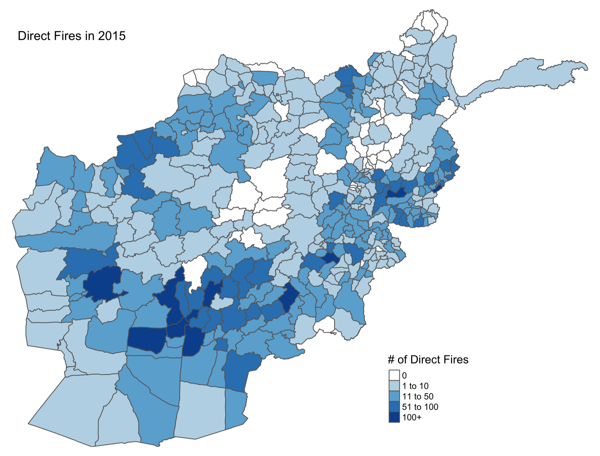
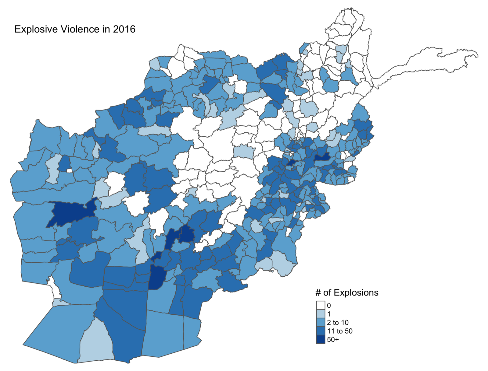
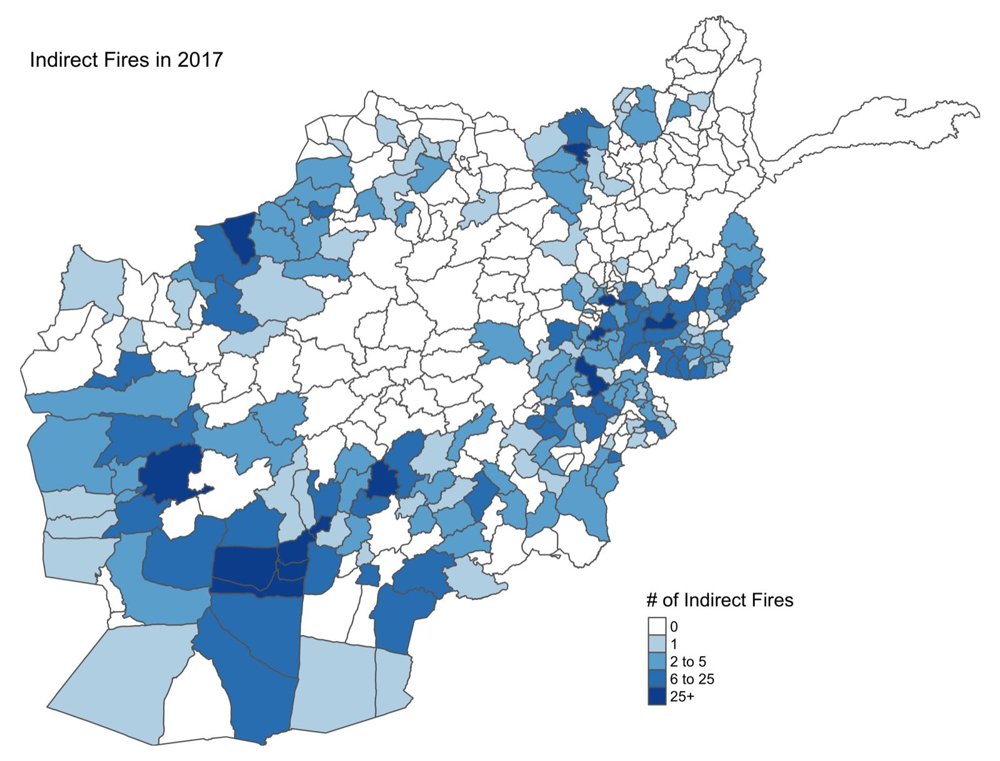
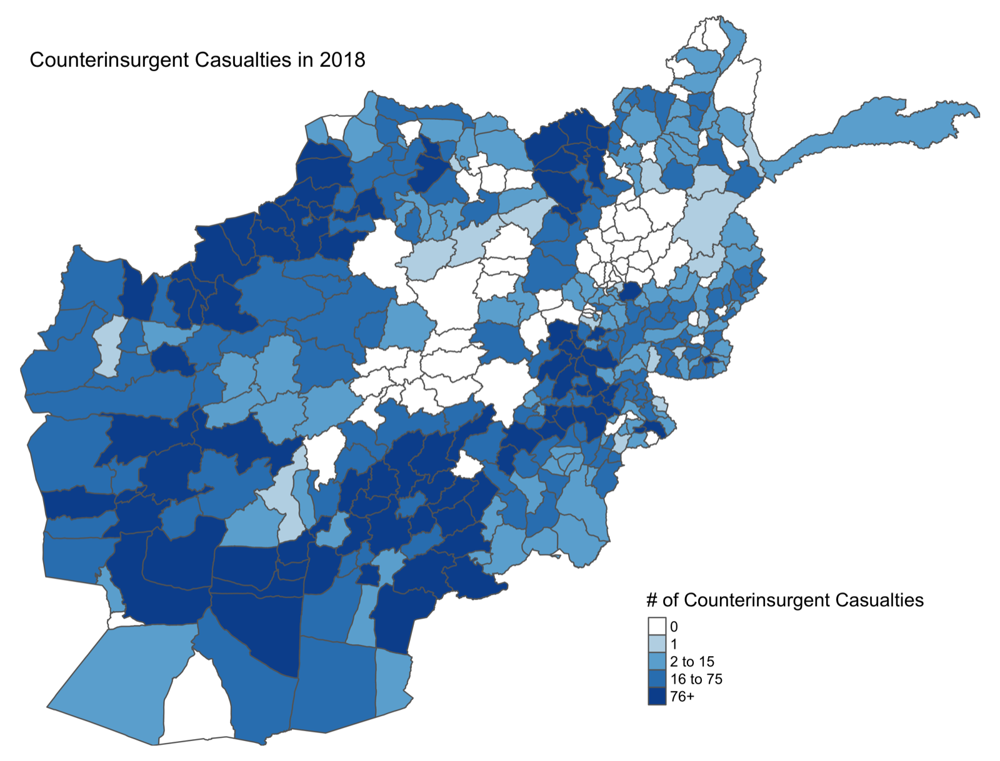
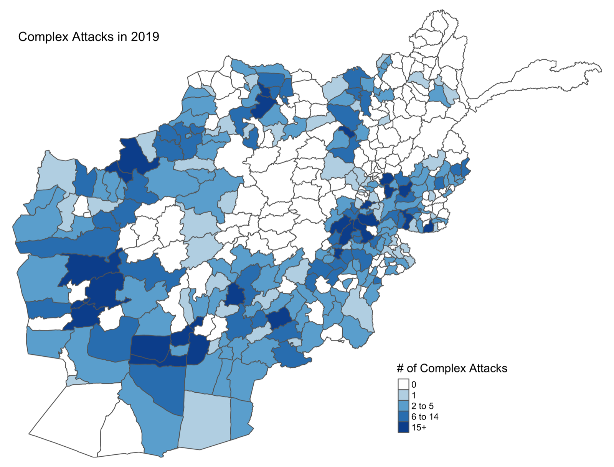
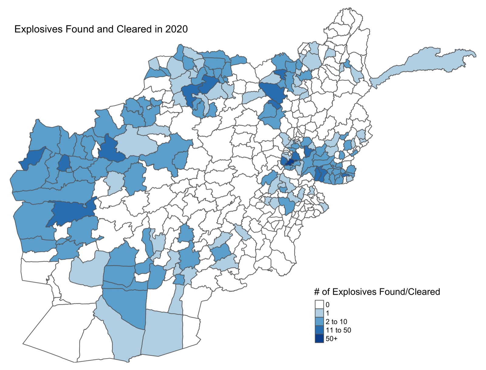

High-fidelity conflict microdata are essential for understanding the dynamics of war in fragile and conflict-affected states. Afghanistan is a particularly important case, given the horrific humanitarian toll of decades of fighting and the vast resources NATO and U.S. forces expended in the country. The U.S. Department of Defense previously released a comprehensive record of combat in Afghanistan — Significant Activities, or SIGACTs — covering 2006 through the end of the NATO combat mission in 2014. Through a data-sharing agreement with NATO, I obtained the successor record, covering conflict in Afghanistan from 2015 through 2020. These records, known as INDURE, document combat in the most violent phase of the war, offering unparalleled insight into Taliban escalation after the 2014 NATO drawdown. The maps below report district-level counts of six event types, one for each year of coverage.

```{=html}
<div id="afgCarousel" class="carousel slide fig-carousel" data-bs-ride="carousel" data-bs-interval="6000">
<div class="carousel-inner">
<div class="carousel-item active">

<div class="carousel-caption-below">Direct fires by district, 2015.</div>
</div>
<div class="carousel-item">

<div class="carousel-caption-below">Explosive violence by district, 2016.</div>
</div>
<div class="carousel-item">

<div class="carousel-caption-below">Indirect fires by district, 2017.</div>
</div>
<div class="carousel-item">

<div class="carousel-caption-below">Counterinsurgent casualties by district, 2018.</div>
</div>
<div class="carousel-item">

<div class="carousel-caption-below">Complex attacks by district, 2019.</div>
</div>
<div class="carousel-item">

<div class="carousel-caption-below">Explosives found and cleared by district, 2020.</div>
</div>
</div>
<button class="carousel-control-prev" type="button" data-bs-target="#afgCarousel" data-bs-slide="prev">
<span class="carousel-control-prev-icon" aria-hidden="true"></span>
<span class="visually-hidden">Previous</span>
</button>
<button class="carousel-control-next" type="button" data-bs-target="#afgCarousel" data-bs-slide="next">
<span class="carousel-control-next-icon" aria-hidden="true"></span>
<span class="visually-hidden">Next</span>
</button>
<div class="carousel-indicators">
<button type="button" data-bs-target="#afgCarousel" data-bs-slide-to="0" class="active" aria-current="true" aria-label="Slide 1"></button>
<button type="button" data-bs-target="#afgCarousel" data-bs-slide-to="1" aria-label="Slide 2"></button>
<button type="button" data-bs-target="#afgCarousel" data-bs-slide-to="2" aria-label="Slide 3"></button>
<button type="button" data-bs-target="#afgCarousel" data-bs-slide-to="3" aria-label="Slide 4"></button>
<button type="button" data-bs-target="#afgCarousel" data-bs-slide-to="4" aria-label="Slide 5"></button>
<button type="button" data-bs-target="#afgCarousel" data-bs-slide-to="5" aria-label="Slide 6"></button>
</div>
</div>
```

### Key references

::: {.data-links}
- Blair, Christopher W. "The Politics of Constraining Humanitarian Access in Conflict." Working paper, Princeton University.
- Blair, Christopher W. 2025. "[Border Fortification and Legibility: Evidence from Afghanistan](https://doi.org/10.1111/ajps.12923)." *American Journal of Political Science* 69(4): 1559–1580.
- Blair, Christopher W., David van Dijcke, and Austin L. Wright. "[Refugee Return and Conflict: Evidence from a Natural Experiment](https://papers.ssrn.com/sol3/papers.cfm?abstract_id=3885937)." Conditionally accepted, *American Economic Review*.
:::
