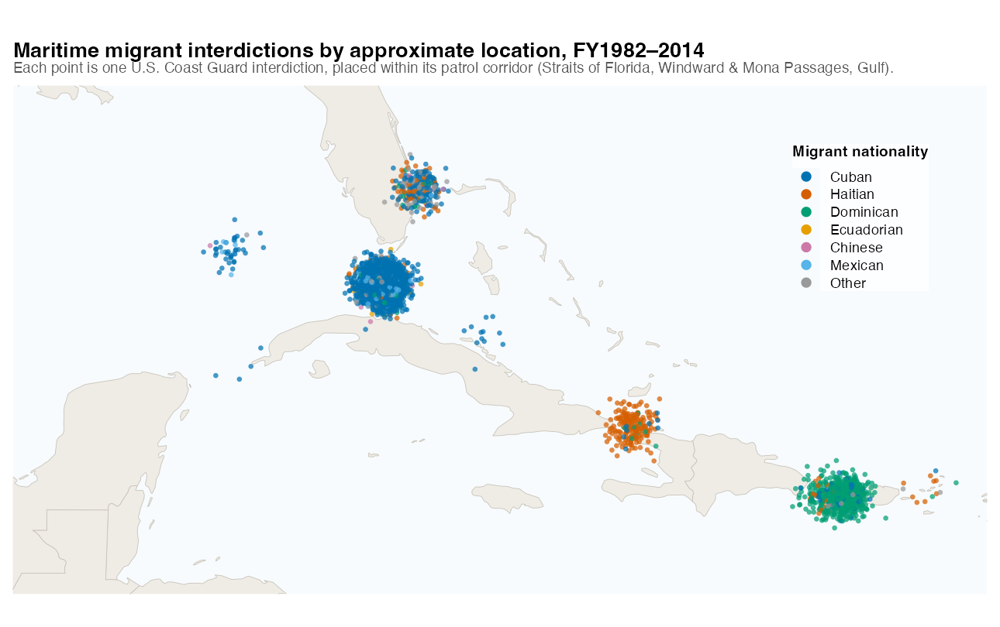
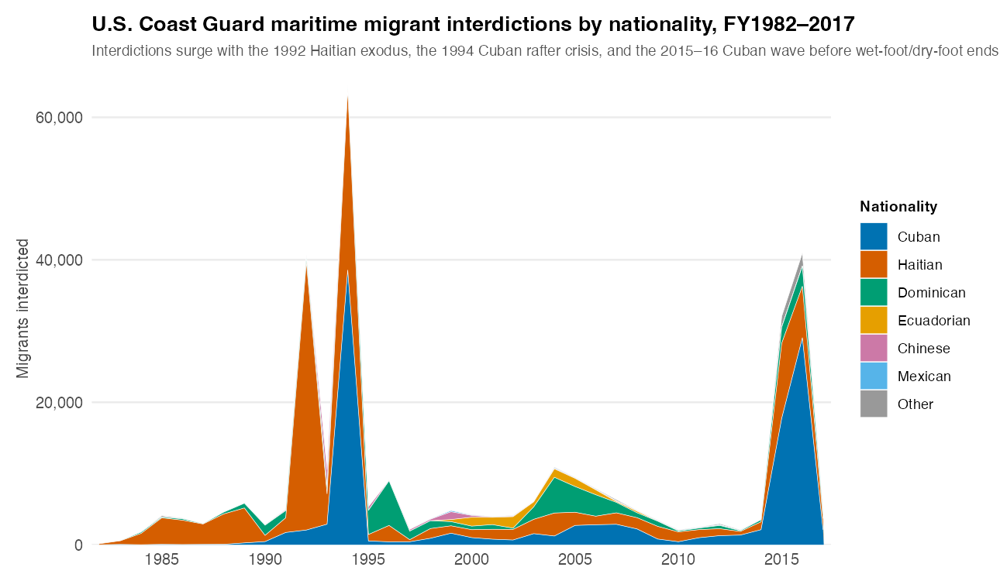
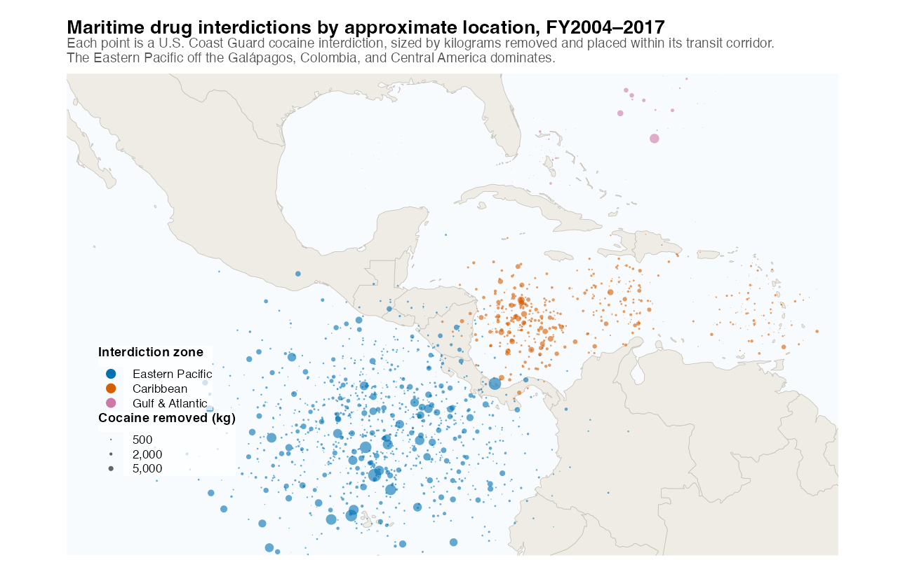
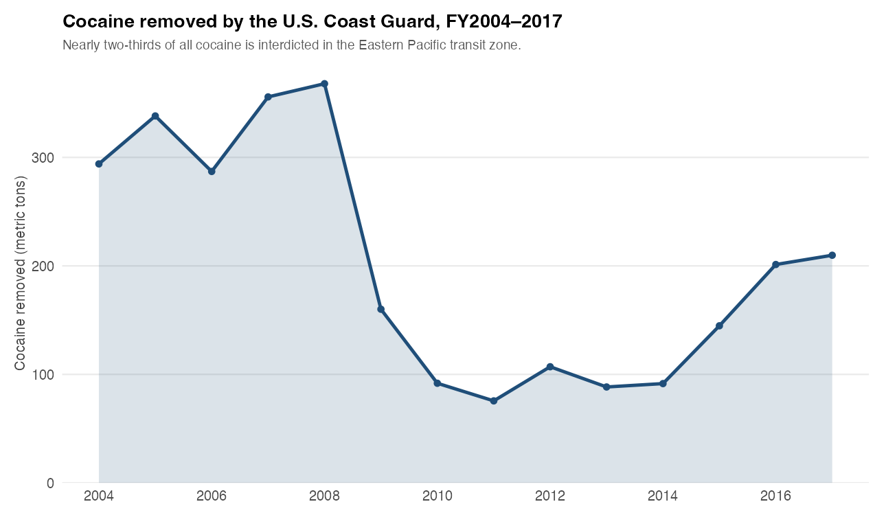

Maritime migration and drug smuggling are central to security and humanitarian policy in the Caribbean basin and the Eastern Pacific, yet granular data on interdiction are hard to come by. Through a series of Freedom of Information Act (FOIA) requests, I assembled declassified U.S. Coast Guard records of every maritime migrant interdiction from FY1982 through FY2017, together with case-level records of the Coast Guard's drug interdictions and cocaine removals over the same period.

### Migrant interdictions

Each migrant interdiction case records the date and location; the U.S. Coast Guard district and patrol corridor — the Straits of Florida, the Windward and Mona Passages, and the Gulf of Mexico; the number of migrants and their nationalities — chiefly Cuban, Haitian, and Dominican, alongside Ecuadorian, Chinese, and Mexican; the interdicting cutter or aircraft and the migrant vessel type; and the disposition of each case, whether repatriation, transfer to Guantánamo, or entry.

```{=html}
<div id="cgMigCarousel" class="carousel slide fig-carousel" data-bs-ride="carousel" data-bs-interval="7000">
<div class="carousel-inner">
<div class="carousel-item active">

<div class="carousel-caption-below">Approximate interdiction locations, colored by migrant nationality (FY1982–2014). Cases cluster in the Straits of Florida (Cuban), the Windward Passage (Haitian), and the Mona Passage (Dominican).</div>
</div>
<div class="carousel-item">

<div class="carousel-caption-below">Migrant interdictions by nationality, FY1982–2017 — the 1992 Haitian exodus, the 1994 Cuban rafter crisis, and the 2015–16 Cuban surge stand out.</div>
</div>
</div>
<button class="carousel-control-prev" type="button" data-bs-target="#cgMigCarousel" data-bs-slide="prev">
<span class="carousel-control-prev-icon" aria-hidden="true"></span>
<span class="visually-hidden">Previous</span>
</button>
<button class="carousel-control-next" type="button" data-bs-target="#cgMigCarousel" data-bs-slide="next">
<span class="carousel-control-next-icon" aria-hidden="true"></span>
<span class="visually-hidden">Next</span>
</button>
<div class="carousel-indicators">
<button type="button" data-bs-target="#cgMigCarousel" data-bs-slide-to="0" class="active" aria-current="true" aria-label="Slide 1"></button>
<button type="button" data-bs-target="#cgMigCarousel" data-bs-slide-to="1" aria-label="Slide 2"></button>
</div>
</div>
```

### Drug interdictions

The drug records document each maritime interdiction — the date, location, and transit corridor; the interdicting cutter; the smuggling vessel and its flag state; and the quantity of cocaine and other narcotics seized and removed. Interdiction is overwhelmingly concentrated in the Eastern Pacific transit zone off the Galápagos, Colombia, and Central America, which accounts for nearly two-thirds of all cocaine removed, with a second concentration in the western Caribbean.

```{=html}
<div id="cgDrugCarousel" class="carousel slide fig-carousel" data-bs-ride="carousel" data-bs-interval="7000">
<div class="carousel-inner">
<div class="carousel-item active">

<div class="carousel-caption-below">Approximate cocaine-interdiction locations, sized by kilograms removed (FY2004–2017). The Eastern Pacific transit zone off the Galápagos and Colombia dominates, with a second concentration in the western Caribbean.</div>
</div>
<div class="carousel-item">

<div class="carousel-caption-below">Cocaine removed by the U.S. Coast Guard, FY2004–2017, in metric tons — a peak in 2007–08, a trough around 2011, and a resurgence through 2017.</div>
</div>
</div>
<button class="carousel-control-prev" type="button" data-bs-target="#cgDrugCarousel" data-bs-slide="prev">
<span class="carousel-control-prev-icon" aria-hidden="true"></span>
<span class="visually-hidden">Previous</span>
</button>
<button class="carousel-control-next" type="button" data-bs-target="#cgDrugCarousel" data-bs-slide="next">
<span class="carousel-control-next-icon" aria-hidden="true"></span>
<span class="visually-hidden">Next</span>
</button>
<div class="carousel-indicators">
<button type="button" data-bs-target="#cgDrugCarousel" data-bs-slide-to="0" class="active" aria-current="true" aria-label="Slide 1"></button>
<button type="button" data-bs-target="#cgDrugCarousel" data-bs-slide-to="1" aria-label="Slide 2"></button>
</div>
</div>
```

::: {.data-links}
**Availability:** these data are available upon request.
:::
