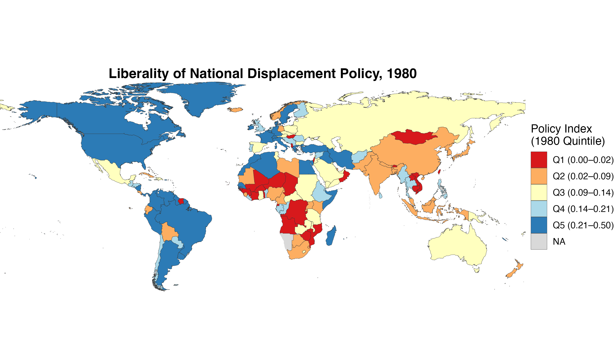
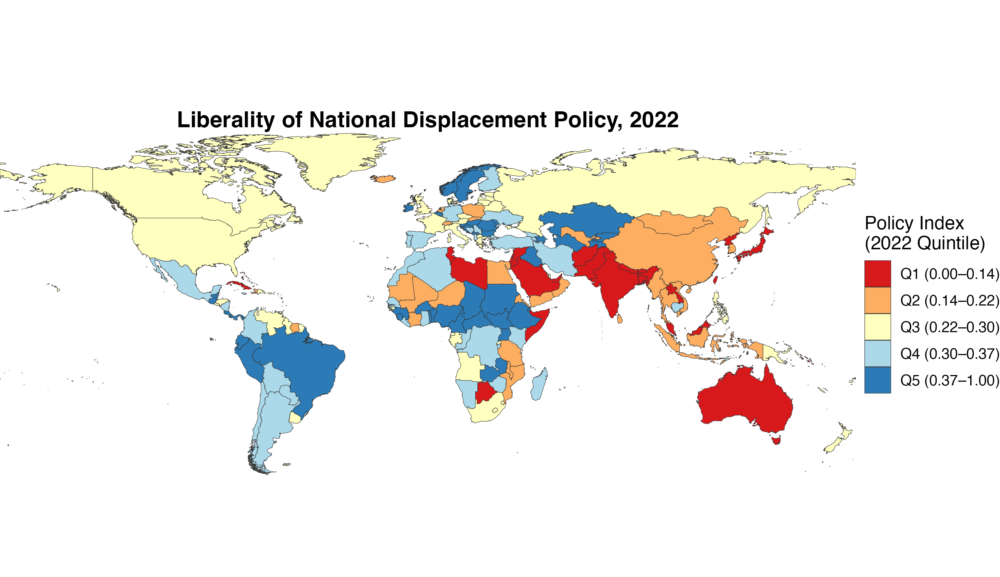
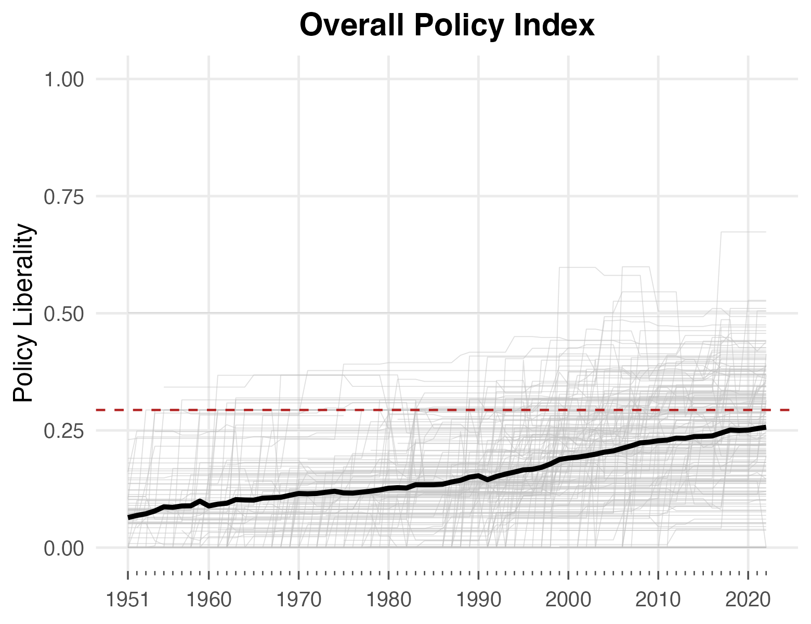
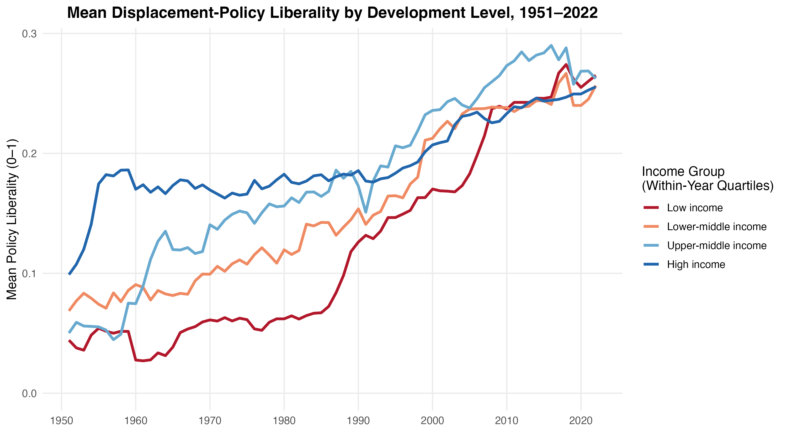

The **DWRAP** dataset — a collaborative effort with Guy Grossman and Jeremy M. Weinstein — offers an original coding of national policies on forced displacement around the world. DWRAP records **54 policy provisions**, drawn from **950+ national-level migration laws** in **every country from 1951 to 2022**. It expands the geographic and temporal scope of existing asylum-policy indices considerably and represents the most comprehensive coding of refugee and asylum policy to date. The corpus of laws pertinent to forced migration was identified chiefly using UNHCR submissions to the Universal Periodic Review (UPR), a mandated, cyclical review of UN member states organized by the Office of the High Commissioner for Human Rights.

We conceptualize refugee and asylum policy as a combination of provisions regulating five core dimensions:

- **Access** — the ease of entrance and security of status
- **Services** — provision of public services and welfare
- **Livelihoods** — the ability to work and own property
- **Movement** — encampment policies
- **Participation** — citizenship and political rights

### Explore & download

::: {.data-links}
**Interactive:** [DWRAP dashboard (World Bank)](https://datanalytics.worldbank.org/dwrap/)

**Data:** [Full dataset (World Bank)](https://datacatalog.worldbank.org/search/dataset/0066171/Dataset-of-World-Refugee-and-Asylum-Policies) · [Replication files (*APSR* 2022)](https://doi.org/10.7910/DVN/AYBXMJ) · [Replication files (*IO* 2022)](https://doi.org/10.7910/DVN/OB6FHX)
:::

```{=html}
<div id="dwrapCarousel" class="carousel slide fig-carousel" data-bs-ride="carousel" data-bs-interval="7000">
<div class="carousel-inner">
<div class="carousel-item active">

<div class="carousel-caption-below">Liberality of national displacement policy, 1980 — countries shaded by DWRAP policy-index quintile; darker blue marks more liberal <em>de jure</em> policy.</div>
</div>
<div class="carousel-item">

<div class="carousel-caption-below">Liberality of national displacement policy, 2022 — countries shaded by DWRAP policy-index quintile; darker blue marks more liberal <em>de jure</em> policy.</div>
</div>
<div class="carousel-item">

<div class="carousel-caption-below">Overall policy-index trajectories by country, 1951–2022. The bold line traces the global average and the red dashed line marks the international convention standard; asylum policy has grown steadily more liberal over time.</div>
</div>
<div class="carousel-item">

<div class="carousel-caption-below">Mean displacement-policy liberality by development level, 1951–2022. Low-income countries have converged toward — and recently overtaken — wealthier states in <em>de jure</em> liberality.</div>
</div>
</div>
<button class="carousel-control-prev" type="button" data-bs-target="#dwrapCarousel" data-bs-slide="prev">
<span class="carousel-control-prev-icon" aria-hidden="true"></span>
<span class="visually-hidden">Previous</span>
</button>
<button class="carousel-control-next" type="button" data-bs-target="#dwrapCarousel" data-bs-slide="next">
<span class="carousel-control-next-icon" aria-hidden="true"></span>
<span class="visually-hidden">Next</span>
</button>
<div class="carousel-indicators">
<button type="button" data-bs-target="#dwrapCarousel" data-bs-slide-to="0" class="active" aria-current="true" aria-label="Slide 1"></button>
<button type="button" data-bs-target="#dwrapCarousel" data-bs-slide-to="1" aria-label="Slide 2"></button>
<button type="button" data-bs-target="#dwrapCarousel" data-bs-slide-to="2" aria-label="Slide 3"></button>
<button type="button" data-bs-target="#dwrapCarousel" data-bs-slide-to="3" aria-label="Slide 4"></button>
</div>
</div>
```

### Key references

::: {.data-links}
- Blair, Christopher W., and Guy Grossman. "The Dataset of World Refugee and Asylum Policies (DWRAP): *de jure* asylum policy for 205 countries, 1951–2022." Working paper.
- World Bank, with Christopher W. Blair, Guy Grossman, and Jeremy M. Weinstein. 2024. "[Dataset of World Refugee and Asylum Policies](https://datacatalog.worldbank.org/search/dataset/0066171/Dataset-of-World-Refugee-and-Asylum-Policies)." *World Bank Development Data Hub*.
- Blair, Christopher W., Guy Grossman, and Jeremy M. Weinstein. 2022. "[Liberal Displacement Policies Attract Forced Migrants in the Global South](https://doi.org/10.1017/S0003055421000848)." *American Political Science Review* 116(1): 351–358.
- Blair, Christopher W., Guy Grossman, and Jeremy M. Weinstein. 2022. "[Forced Displacement and Asylum Policy in the Developing World](https://doi.org/10.1017/S0020818321000369)." *International Organization* 76(2): 337–378.
:::
