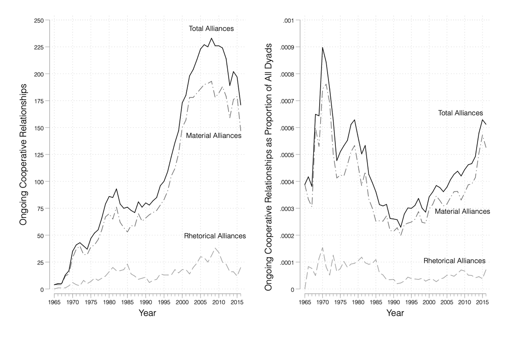
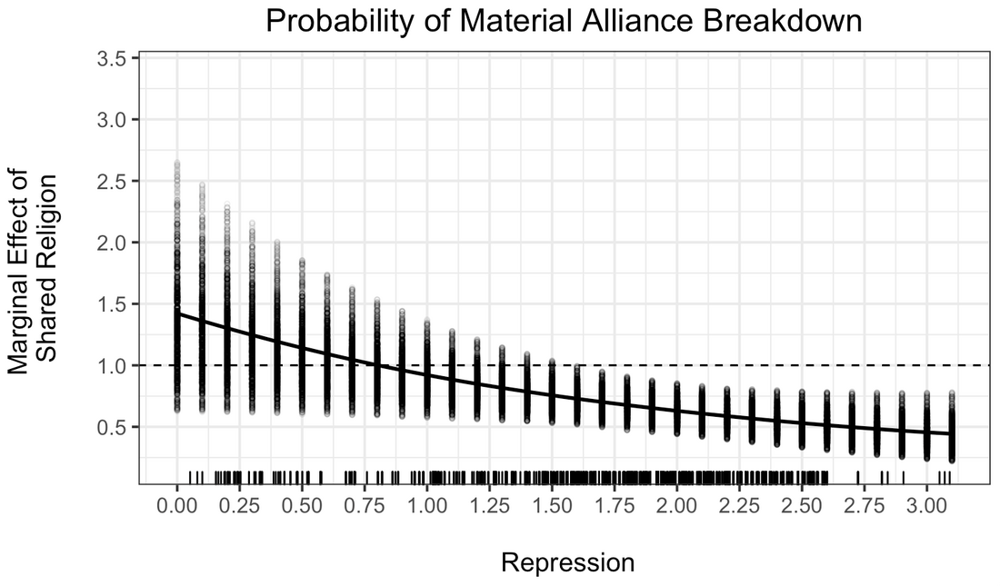
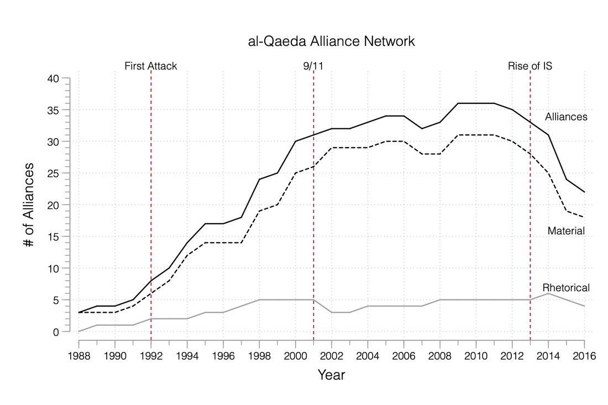
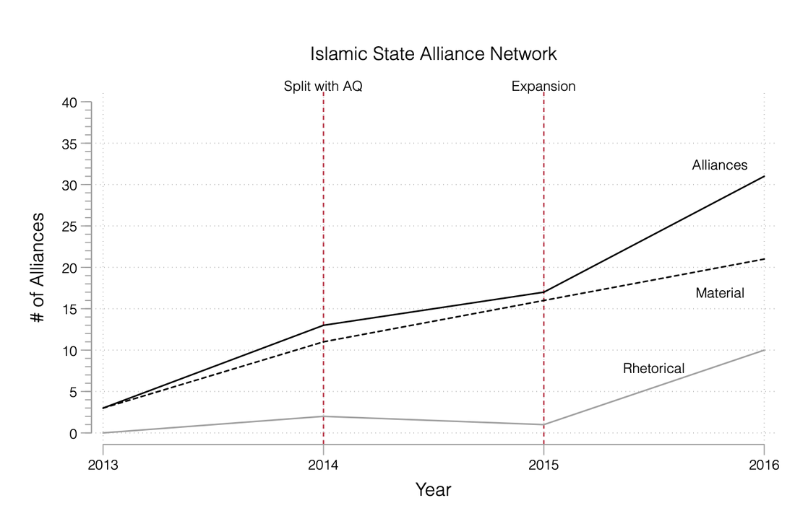
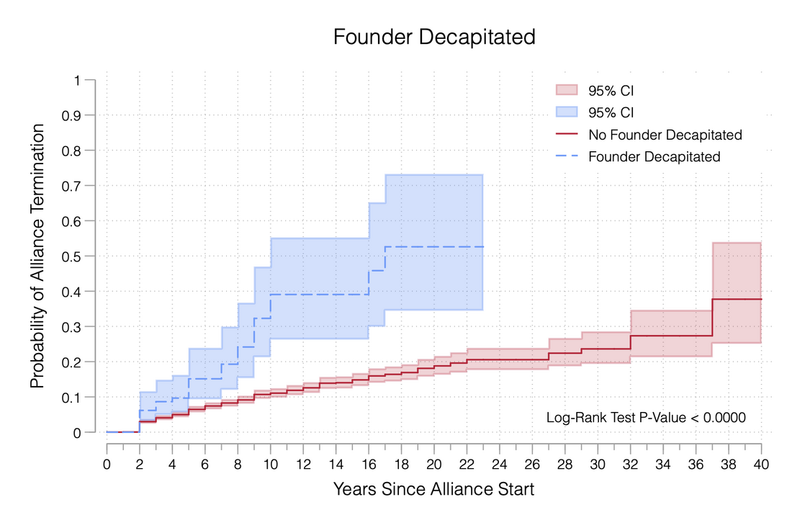
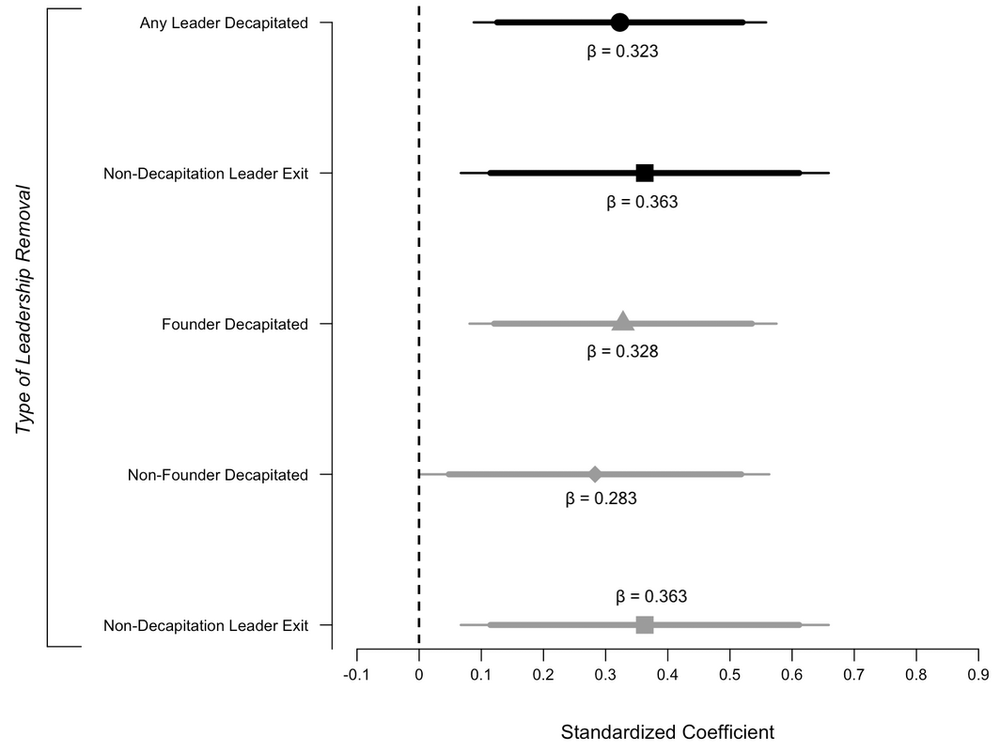

The **MGAR** dataset — a collaborative effort with Erica Chenoweth, Michael C. Horowitz, Evan Perkoski, and Philip B.K. Potter — offers an original coding of cooperative and conflictual relationships between militant groups. MGAR records the type and content of relationships among **2,613 militant groups from 1950 to 2016**, documenting **7,409 dyad-years** in which a relationship existed between groups — significantly expanding the set of relationships identified in prior work. MGAR also captures when each relationship began and ended, and what it entailed.

We categorize the nature of each relationship along a spectrum from cooperation to conflict: allies (the strongest form of cooperation), associates, supporters, fans (verbal but not material support), hosts (primarily states), rivals, and competitors (the strongest form of conflict). For each cooperative dyad-year we further code whether the relationship involved operational (e.g., shared membership, joint operations, tactical advising), material (i.e., arms transfers), territorial (e.g., shared bases), training, or financial (i.e., cash transfers) support.

### Explore & download

::: {.data-links}
**Explore:** [MGAR database (National Security Policy Center)](https://nspcbatten.org/mgar/)

**Data:** [Replication files (*IO* 2022)](https://doi.org/10.7910/DVN/PHUSUM) · [Replication files (*JOP* 2022)](https://doi.org/10.7910/DVN/DAQ9PK) · [Replication files (*JOGSS* 2023)](https://doi.org/10.7910/DVN/MDVLYF)
:::

```{=html}
<div id="mgarCarousel" class="carousel slide fig-carousel" data-bs-ride="carousel" data-bs-interval="7000">
<div class="carousel-inner">
<div class="carousel-item active">

<div class="carousel-caption-below">Cooperative relationships between militant groups, 1965–2016 — total, material, and rhetorical alliances — in raw counts (left) and as a share of all group dyads (right).</div>
</div>
<div class="carousel-item">

<div class="carousel-caption-below">The marginal effect of shared religion on the hazard of material-alliance breakdown, across levels of state repression. As repression intensifies, shared religion increasingly holds cooperative ties together (effect falls below one).</div>
</div>
<div class="carousel-item">

<div class="carousel-caption-below">The growth of al-Qaeda's alliance network, 1988–2016, distinguishing material from rhetorical ties.</div>
</div>
<div class="carousel-item">

<div class="carousel-caption-below">The Islamic State's alliance network, 2013–2016, before and after its split with al-Qaeda.</div>
</div>
<div class="carousel-item">

<div class="carousel-caption-below">Militant alliances terminate far faster after a group's founding leader is killed (dashed) than when the founder survives (solid).</div>
</div>
<div class="carousel-item">

<div class="carousel-caption-below">Different forms of leadership removal and their association with alliance breakdown — every type raises the probability that an alliance ends.</div>
</div>
</div>
<button class="carousel-control-prev" type="button" data-bs-target="#mgarCarousel" data-bs-slide="prev">
<span class="carousel-control-prev-icon" aria-hidden="true"></span>
<span class="visually-hidden">Previous</span>
</button>
<button class="carousel-control-next" type="button" data-bs-target="#mgarCarousel" data-bs-slide="next">
<span class="carousel-control-next-icon" aria-hidden="true"></span>
<span class="visually-hidden">Next</span>
</button>
<div class="carousel-indicators">
<button type="button" data-bs-target="#mgarCarousel" data-bs-slide-to="0" class="active" aria-current="true" aria-label="Slide 1"></button>
<button type="button" data-bs-target="#mgarCarousel" data-bs-slide-to="1" aria-label="Slide 2"></button>
<button type="button" data-bs-target="#mgarCarousel" data-bs-slide-to="2" aria-label="Slide 3"></button>
<button type="button" data-bs-target="#mgarCarousel" data-bs-slide-to="3" aria-label="Slide 4"></button>
<button type="button" data-bs-target="#mgarCarousel" data-bs-slide-to="4" aria-label="Slide 5"></button>
<button type="button" data-bs-target="#mgarCarousel" data-bs-slide-to="5" aria-label="Slide 6"></button>
</div>
</div>
```

### Key references

::: {.data-links}
- Blair, Christopher W., and Philip B.K. Potter. 2023. "[The Strategic Logic of Large Militant Alliance Networks](https://doi.org/10.1093/jogss/ogac035)." *Journal of Global Security Studies* 8(1): 1–22.
- Blair, Christopher W., Michael C. Horowitz, and Philip B.K. Potter. 2022. "[Leadership Targeting and Militant Alliance Breakdown](https://doi.org/10.1086/715604)." *The Journal of Politics* 84(2): 923–943.
- Blair, Christopher W., Erica Chenoweth, Michael C. Horowitz, Evan Perkoski, and Philip B.K. Potter. 2022. "[Honor Among Thieves: Understanding Rhetorical and Material Cooperation Among Violent Non-State Actors](https://doi.org/10.1017/S0020818321000114)." *International Organization* 76(1): 164–203.
:::
