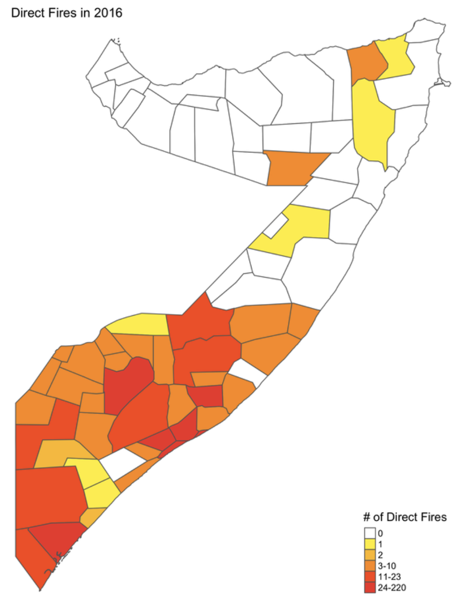
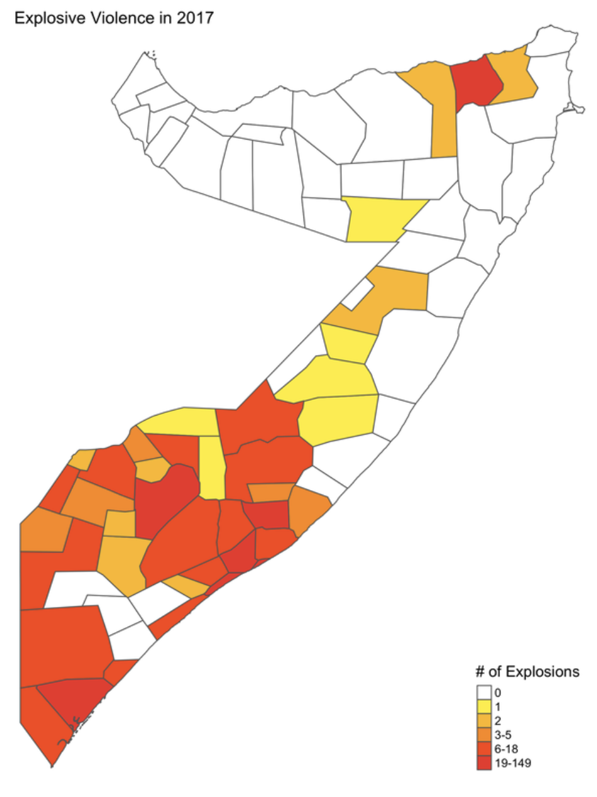
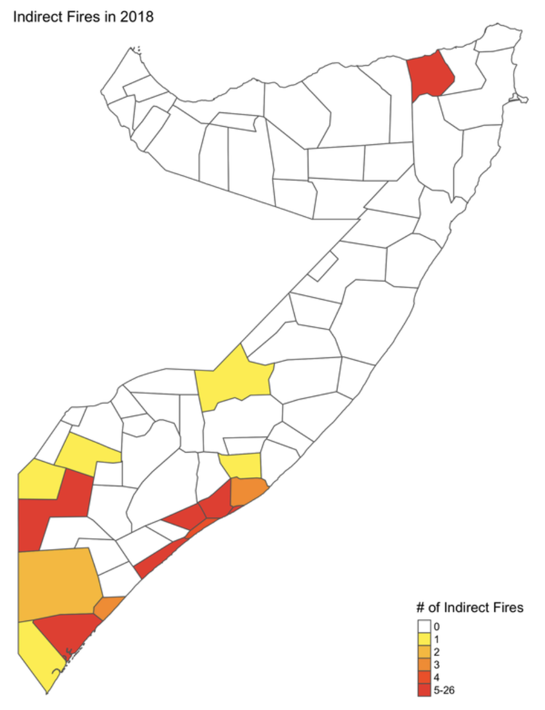
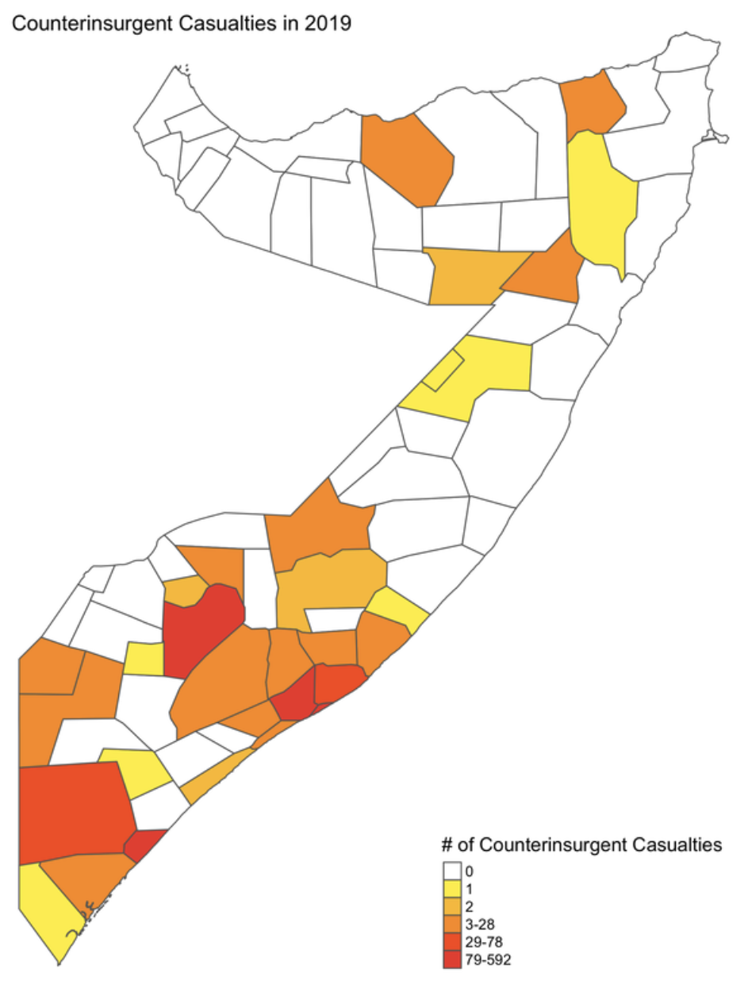

High-fidelity conflict microdata are essential for understanding the dynamics of war in fragile and conflict-affected countries. Somalia is a particularly important case, given the horrific humanitarian toll of decades of fighting and the vast resources the African Union and U.S. forces expended in the country. The U.S. Department of Defense has never released a record of combat in Somalia, though U.S. forces compiled Significant Activities — SIGACTs — reports while deployed there. Through a data-sharing agreement with NATO, I obtained a successor record of SIGACTs covering conflict in Somalia from 2016 through April 2019. These records, known as INDURE, document combat in a recent phase of the war, offering unparalleled insight into how al-Shabaab regrouped in the years following the African Union's AMISOM intervention. The maps below report district-level counts of four event types, one for each year of coverage.

```{=html}
<div id="somCarousel" class="carousel slide fig-carousel tall" data-bs-ride="carousel" data-bs-interval="6000">
<div class="carousel-inner">
<div class="carousel-item active">

<div class="carousel-caption-below">Direct fires by district, 2016.</div>
</div>
<div class="carousel-item">

<div class="carousel-caption-below">Explosive violence by district, 2017.</div>
</div>
<div class="carousel-item">

<div class="carousel-caption-below">Indirect fires by district, 2018.</div>
</div>
<div class="carousel-item">

<div class="carousel-caption-below">Counterinsurgent casualties by district, 2019.</div>
</div>
</div>
<button class="carousel-control-prev" type="button" data-bs-target="#somCarousel" data-bs-slide="prev">
<span class="carousel-control-prev-icon" aria-hidden="true"></span>
<span class="visually-hidden">Previous</span>
</button>
<button class="carousel-control-next" type="button" data-bs-target="#somCarousel" data-bs-slide="next">
<span class="carousel-control-next-icon" aria-hidden="true"></span>
<span class="visually-hidden">Next</span>
</button>
<div class="carousel-indicators">
<button type="button" data-bs-target="#somCarousel" data-bs-slide-to="0" class="active" aria-current="true" aria-label="Slide 1"></button>
<button type="button" data-bs-target="#somCarousel" data-bs-slide-to="1" aria-label="Slide 2"></button>
<button type="button" data-bs-target="#somCarousel" data-bs-slide-to="2" aria-label="Slide 3"></button>
<button type="button" data-bs-target="#somCarousel" data-bs-slide-to="3" aria-label="Slide 4"></button>
</div>
</div>
```

### Key references

::: {.data-links}
- Blair, Christopher W. 2026. "[Dynamics of Internal Displacement and Conflict in Somalia](https://doi.org/10.1080/1369183X.2025.2595818)." *Journal of Ethnic and Migration Studies* 52(4): 1011–1045.
:::
