Peer-reviewed articles appear below (most recent first), followed by working papers under review, other publications, and selected works in progress. Expand any **Abstract** to read the summary and see figures from the paper. Replication materials are archived on my [Harvard Dataverse](https://dataverse.harvard.edu/dataverse/cwblair).

## Peer-Reviewed Publications

::::: {.pub}
:::: {.pubnum}
(17.)
::::
:::: {.pub-body}
**[Refugee Return and Conflict: Evidence from a Natural Experiment](https://papers.ssrn.com/sol3/papers.cfm?abstract_id=3885937)**

*Conditionally accepted, American Economic Review* · with David van Dijcke and Austin L. Wright

Abstract

We estimate the causal effect of a large cash-assistance program for refugee returnees on conflict in Afghanistan. The program led to a significant increase in repatriation. Leveraging historical returnee settlement patterns and previously unreleased combat records, we find that policy-induced refugee return had cross-cutting effects, reducing insurgent violence but increasing social conflict. The program's cash benefits were substantial and may have raised reservation wages in communities where returnees repatriated. Consistent with this hypothesis, returnee encashment had heterogeneous effects on insurgent violence, decreasing the use of labor-intensive combat while reducing the effectiveness of counterinsurgent bomb-neutralization missions. Kinship ties and access to informal dispute-resolution institutions significantly offset the risks of refugee return for communal violence. These results highlight unintended consequences of repatriation aid and clarify the conditions under which refugee return affects conflict.

[SSRN](https://papers.ssrn.com/sol3/papers.cfm?abstract_id=3885937)

[★ Runner-Up, 2023 ISA Kenneth Boulding Award for Peace Studies]{.award}
::::
:::::

::::: {.pub}
:::: {.pubnum}
(16.)
::::
:::: {.pub-body}
**[Historical Analogies and Public Support for Foreign Policy Action](https://doi.org/10.1177/00220027251399905)**

*Forthcoming, Journal of Conflict Resolution* · with Paul Lendway and Joshua A. Schwartz

Abstract

Politicians frequently use historical analogies to justify their preferred foreign policies, yet it remains unclear whether, how, and why they shape public opinion. We conduct the most comprehensive experimental test to date of the impact of historical analogies on the U.S. public's foreign policy preferences and find compelling evidence that analogical appeals increase mass confidence in leaders' foreign policy decisionmaking. We illustrate several of the key mechanisms underlying this dynamic and show that historical analogies are more effective at shaping public opinion than (arguably) less rational justifications like "gut" or intuition. Analogical reasoning is no more effective than other rational justifications, such as appeals to experts, and these strategies work through similar mechanisms. Analogies are thus one of many potentially effective devices in leaders' broader rhetorical toolkits.

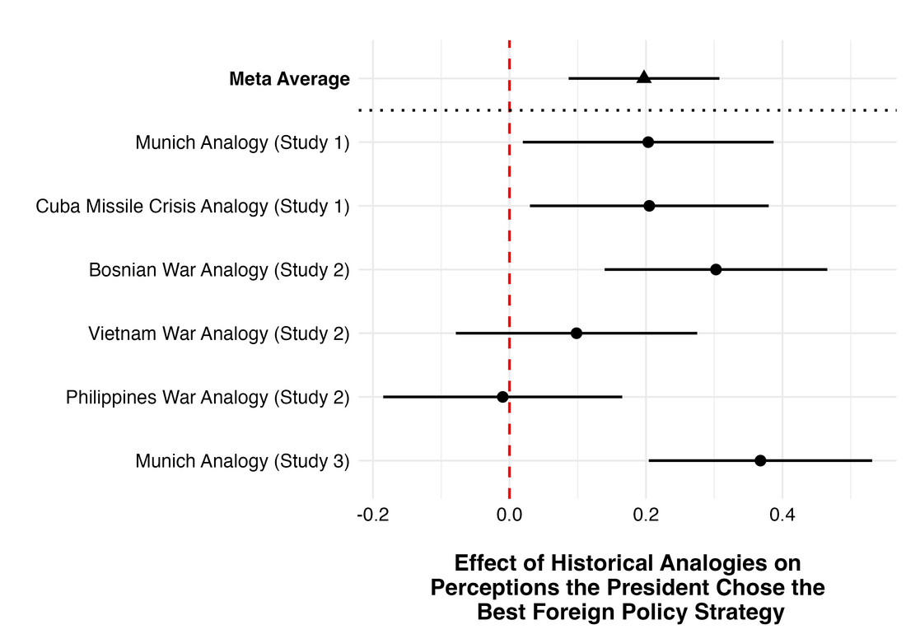
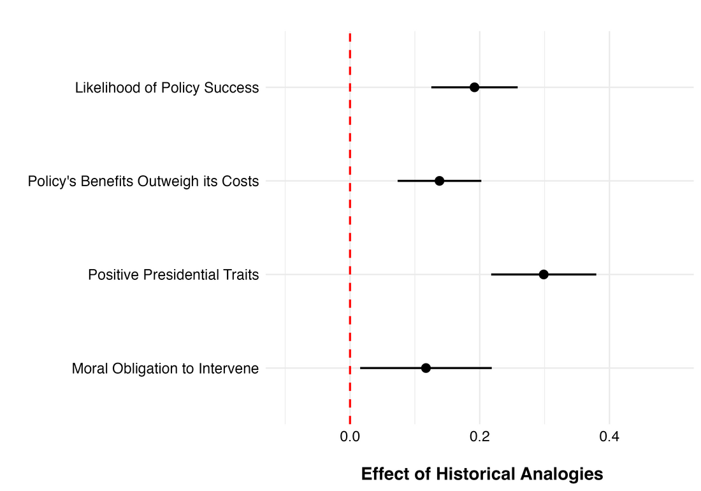

[Publisher](https://doi.org/10.1177/00220027251399905) · [PDF](files/article-historical-analogies-and-public-support-for-foreign-policy-action.pdf) · [Appendix](files/appendix-historical-analogies-and-public-support-for-foreign-policy-action.pdf) · Pre-Analysis Plans ([1](https://osf.io/chtem/overview), [2](https://osf.io/3krbf/overview), [3](https://osf.io/p79jm/overview)) · [Replication Data](https://doi.org/10.7910/DVN/JU4PNR)
::::
:::::

::::: {.pub}
:::: {.pubnum}
(15.)
::::
:::: {.pub-body}
**[Dynamics of Internal Displacement and Conflict in Somalia](https://doi.org/10.1080/1369183X.2025.2595818)**

*Journal of Ethnic and Migration Studies*, 2026, 52(4): 1011–1045

Abstract

Internal displacement is the most common form of forced migration worldwide, and an important tactic of eliminationist politics. Somalia is arguably the country most affected — internally displaced people (IDPs) comprise 22% of the Somali population, totaling more than 3.5 million. In this paper I explore the causes and consequences of IDP-hosting in Somalia, using comprehensive, granular data on migrant flows and newly released government microdata on conflict. Using a two-part research design that balances description and inference, I study patterns of IDP movement and the consequences of internal displacement for conflict in IDP-hosting communities. I find that common factors shape patterns of conflict-induced and climate-induced displacement: IDPs flow from violent, poor, and climate-vulnerable areas to safer, wealthier, and more climate-resilient areas. In response to inflows of IDPs about whom they lack detailed knowledge, insurgents escalate information-gathering and engage in intimidation to dissuade collaboration with government forces. IDP inflows are also linked with worsening communal conflict.

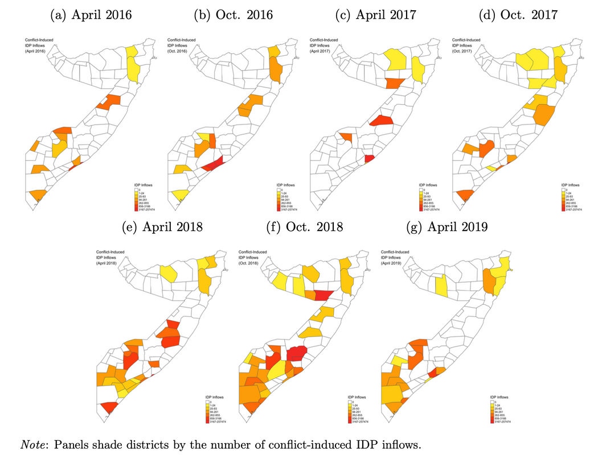
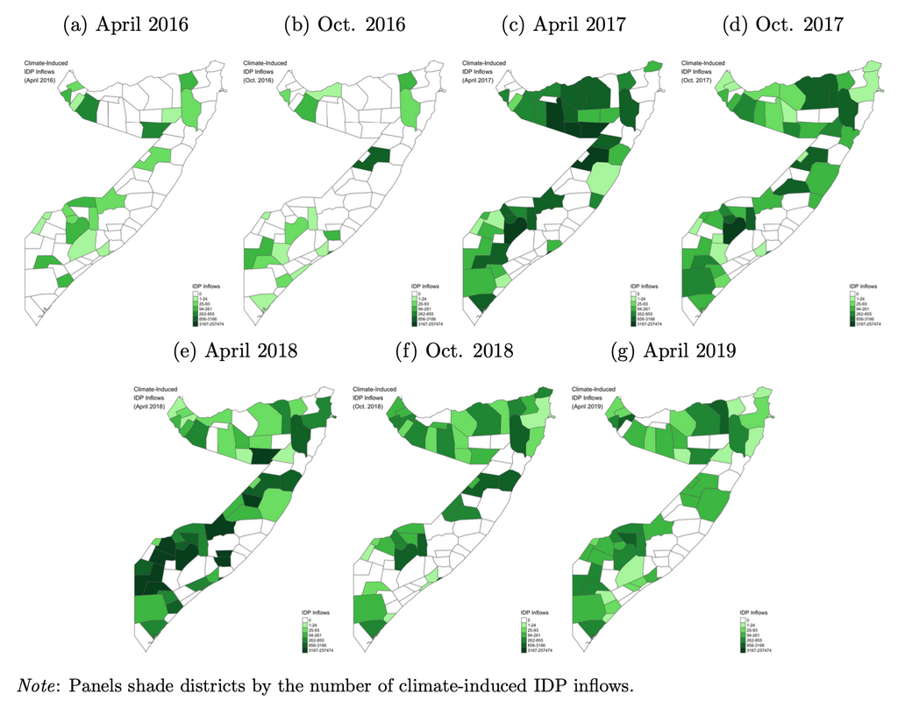

[Publisher](https://doi.org/10.1080/1369183X.2025.2595818) · [PDF](files/article-dynamics-of-internal-displacement-and-conflict-in-somalia.pdf) · [Appendix](files/appendix-dynamics-of-internal-displacement-and-conflict-in-somalia.pdf) · [Replication Data](https://doi.org/10.7910/DVN/J11ANY)
::::
:::::

::::: {.pub}
:::: {.pubnum}
(14.)
::::
:::: {.pub-body}
**[Border Fortification and Legibility: Evidence from Afghanistan](https://doi.org/10.1111/ajps.12923)**

*American Journal of Political Science*, 2025, 69(4): 1559–1580

Abstract

States often fortify their borders against militant threats. How do these efforts shape civilian welfare and perceptions in borderland communities? I conceptualize border fortification as a legibility-building endeavor. By bolstering state reach in areas of weak historical penetration, fortification enhances the government's capacity for monitoring, administration, and control. Yet expanding state authority also disrupts traditional cross-border markets, and a trade-off between security and corruption emerges. Combining administrative records on violence with representative data from a NATO-commissioned survey fielded across Afghanistan in a difference-in-differences framework, I find that fortification facilitates government information-collection, improving security provision and fostering civilian reliance on state forces. Enhanced state capacity is countervailed by negative economic impacts: by disturbing the informal borderland economy, fortification fuels criminalization and local opposition, as civilians rely on illicit economic entrepreneurs to sustain market access and higher smuggling rents fuel official corruption.

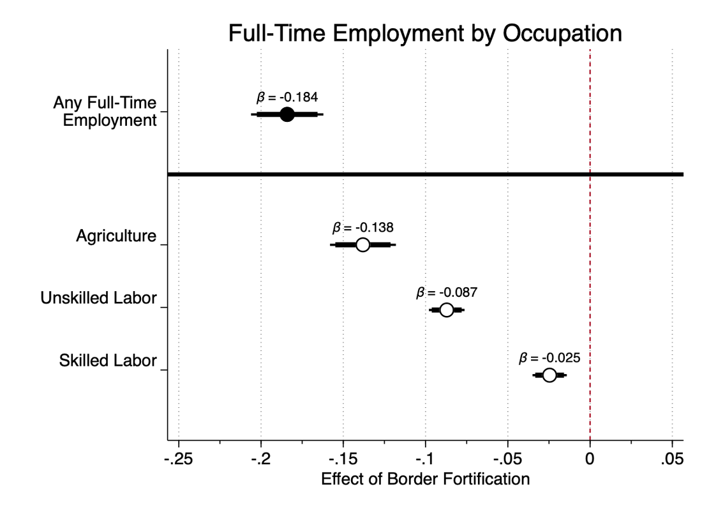
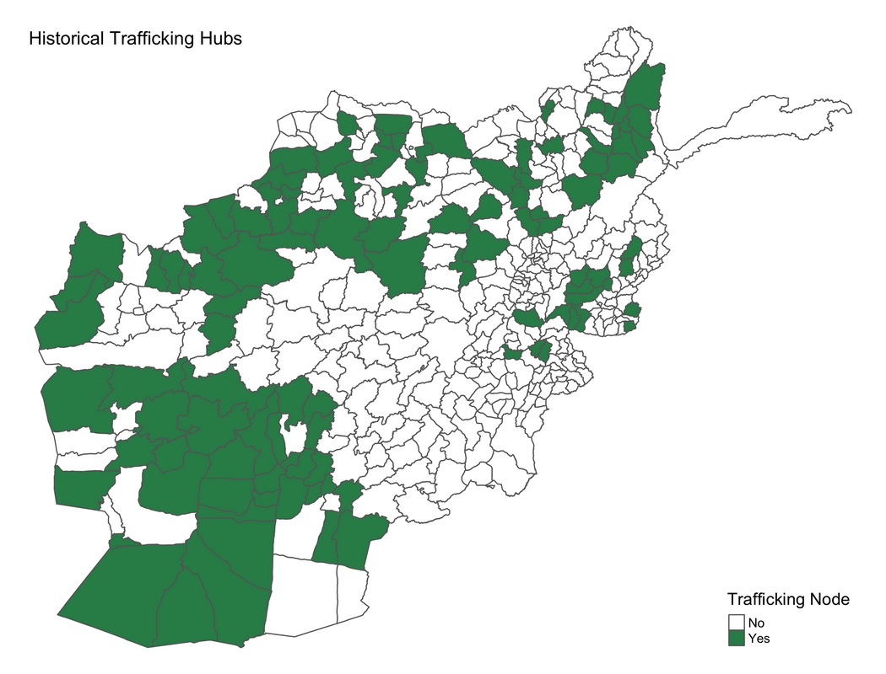

[Publisher](https://doi.org/10.1111/ajps.12923) · [PDF](files/article-border-fortification-and-legibility.pdf) · [Appendix](files/appendix-border-fortification-and-legibility.pdf) · [Replication Data](https://doi.org/10.7910/DVN/HBSARA)

[★ Winner, 2023 Peace Science Society Stuart A. Bremer Award]{.award}
::::
:::::

::::: {.pub}
:::: {.pubnum}
(13.)
::::
:::: {.pub-body}
**[In the Eye of the Storm: Hurricanes, Climate Migration, and Climate Attitudes](https://doi.org/10.1017/S0003055424000352)**

*American Political Science Review*, 2024, 118(4): 1593–1613 · with Sabrina B. Arias

Abstract

Climate disasters raise the salience of climate change's negative consequences, including climate-induced migration. Policy action to address climate displacement is especially contentious in the U.S., where weak support for tackling climate change intersects with high opposition to migration. Do climate disasters foster receptivity toward climate migrants and broader willingness to combat climate change? Leveraging the occurrence of Hurricane Ian during fielding of a pre-registered survey in autumn 2022, we find that hurricane exposure increased concern about and support for policies to address climate migration, as well as support for climate action and belief in anthropogenic climate change. Effects cross-cut partisanship, education, age, and other correlates of climate attitudes, but decay within six months. Climate disasters may briefly increase favorability toward climate migrants and climate policy action, but are unlikely to durably mobilize support even in severely impacted areas.

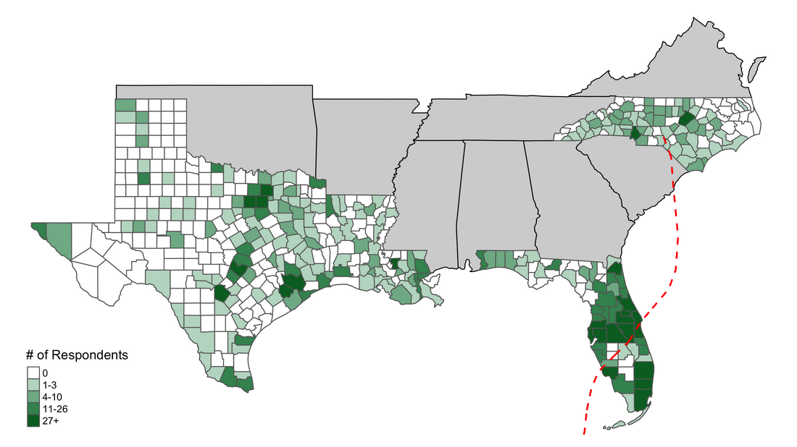
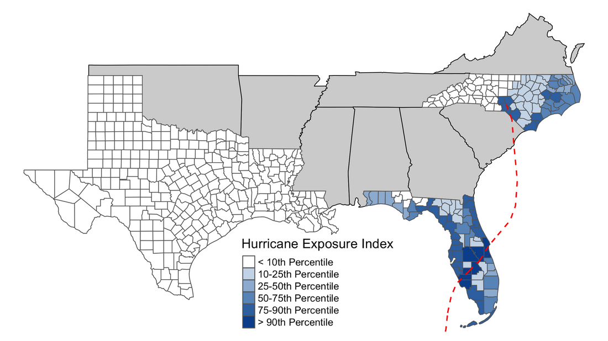

[Publisher](https://doi.org/10.1017/S0003055424000352) · [PDF](files/article-in-the-eye-of-the-storm.pdf) · [Appendix](files/appendix-in-the-eye-of-the-storm.pdf) · [Supplement](files/supplement-in-the-eye-of-the-storm.pdf) · [Pre-Analysis Plan](https://osf.io/bhn7x/) · [Replication Data](https://doi.org/10.7910/DVN/XPTMGF)

[★ Cover article]{.award}
::::
:::::

::::: {.pub}
:::: {.pubnum}
(12.)
::::
:::: {.pub-body}
**[The Fortification Dilemma: Border Control and Rebel Violence](https://doi.org/10.1111/ajps.12794)**

*American Journal of Political Science*, 2024, 68(4): 1366–1385

Abstract

Where cross-border sanctuaries enable rebels to marshal external support, classical theories of counterinsurgency extol the strategic value of border fortification. By sealing borders, counterinsurgents can erode transnational militants' resources, degrading the quality of rebellion. Extending resource-centric theories of conflict, I posit a fortification dilemma. Externally supplied rebels can afford conventional attacks and civilian victimization; when border fortifications interdict their foreign logistics, insurgents compensate by cultivating greater local support, preferring more irregular attacks and cooperative relations with civilians. Counterinsurgent border fortification thus trades reduced rebel capabilities for greater competition over local hearts and minds. Using declassified microdata on border fortification and violence in Iraq, I highlight the central link between border control and cross-border militancy, and show how governments can contest the transnational dimensions of civil wars.

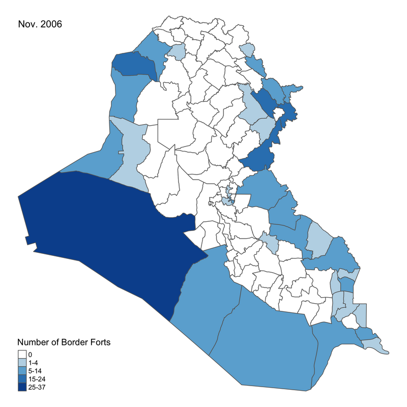
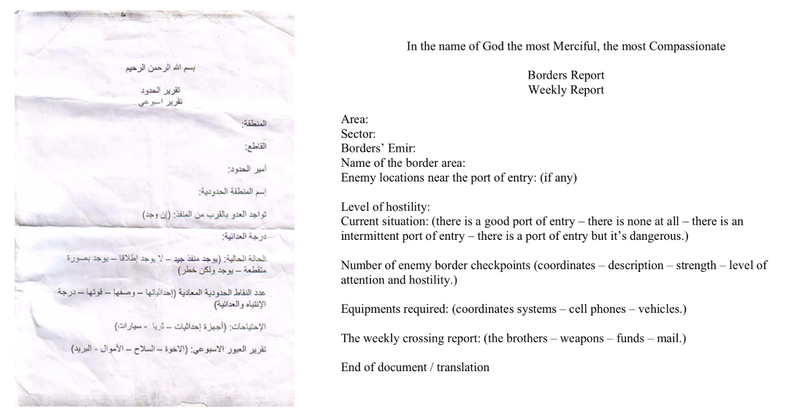

[Publisher](https://doi.org/10.1111/ajps.12794) · [PDF](files/article-the-fortification-dilemma.pdf) · [Appendix](files/appendix-the-fortification-dilemma.pdf) · [Replication Data](https://doi.org/10.7910/DVN/F2RDCJ)
::::
:::::

::::: {.pub}
:::: {.pubnum}
(11.)
::::
:::: {.pub-body}
**[Military Attitudes on the Chemical Weapons Taboo: Evidence from the Pacific Theater](https://doi.org/10.1086/726955)**

*The Journal of Politics*, 2024, 86(3): 1075–1082 · with Michael C. Horowitz

Abstract

Little is known about military attitudes toward weapons taboos, or the durability of non-use norms in wartime. Chemical weapons are a key case given public revulsion and clear international prohibitions. We explore soldiers' attitudes in a salient setting: the Pacific theater of World War II, drawing on a declassified survey covering a representative sample of enlisted US soldiers in Hawaii in 1944. This context — a total war against an adversary that had employed chemical weapons — represents a hard test for the chemical-weapons taboo. Up to 91% of soldiers supported using chemical weapons against Japan, including 24% who favored initiation and 67% who favored retaliatory use. Exploiting a training regimen that exposed some troops to lachrymatory gas, we find that exposure to chemical weapons in training reduced support for use. Visceral experiences can mobilize support for weapons taboos in otherwise permissive environments.

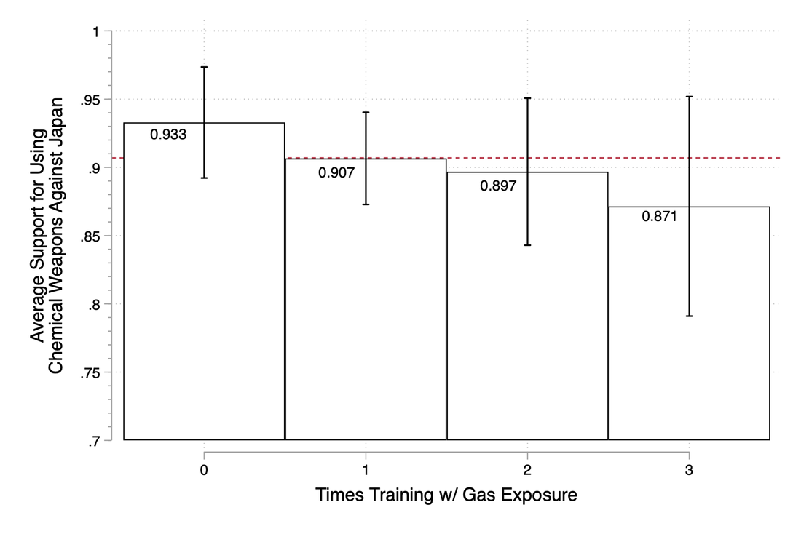

[Publisher](https://doi.org/10.1086/726955) · [PDF](files/article-military-attitudes-on-the-chemical-weapons-taboo.pdf) · [Appendix](files/appendix-military-attitudes-on-the-chemical-weapons-taboo.pdf) · [Replication Data](https://doi.org/10.7910/DVN/AIDUDC)
::::
:::::

::::: {.pub}
:::: {.pubnum}
(10.)
::::
:::: {.pub-body}
**[The Gendered Peace Premium](https://doi.org/10.1093/isq/sqad090)**

*International Studies Quarterly*, 2023, 67(4): 1–16 · with Joshua A. Schwartz

Abstract

The adage that "only Nixon could go to China" suggests hawkish leaders face fewer domestic barriers to conciliation. We explore how this intersects with gender stereotypes about women's role in national security. In a series of survey experiments, we find evidence of a gendered peace premium — a penalty women leaders face for pursuing peace. When women leaders seek rapprochement with foreign adversaries, they are perceived as acting "according to type," and their conciliatory proposals are viewed as less likely to be in the national interest than identical policies pursued by men. Partisanship significantly moderates this dynamic, and policy success can attenuate women leaders' disadvantage. While this does not make it impossible for women leaders to seek and achieve peace, it makes it more difficult and politically costly than some perspectives assume.

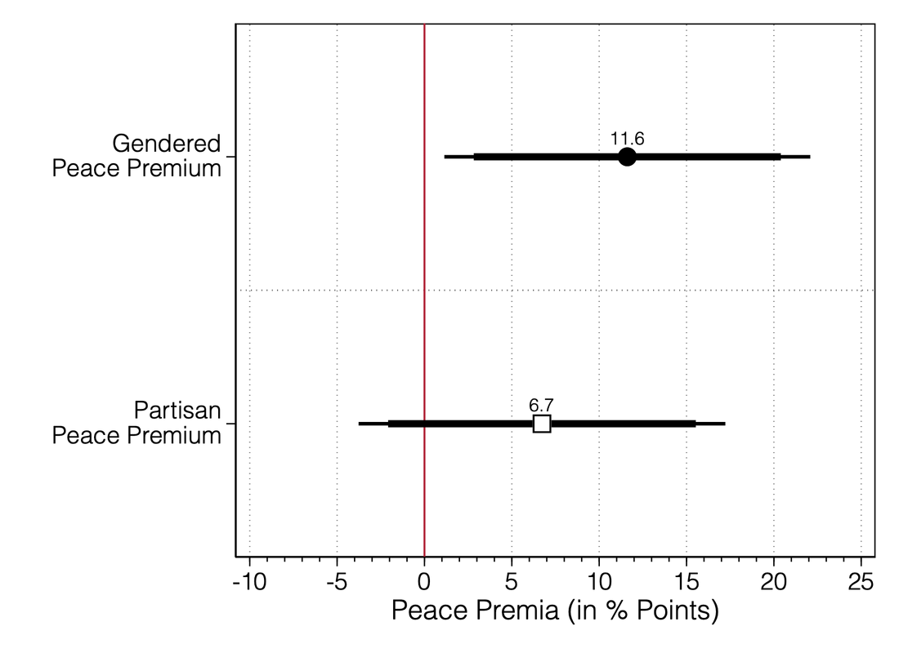
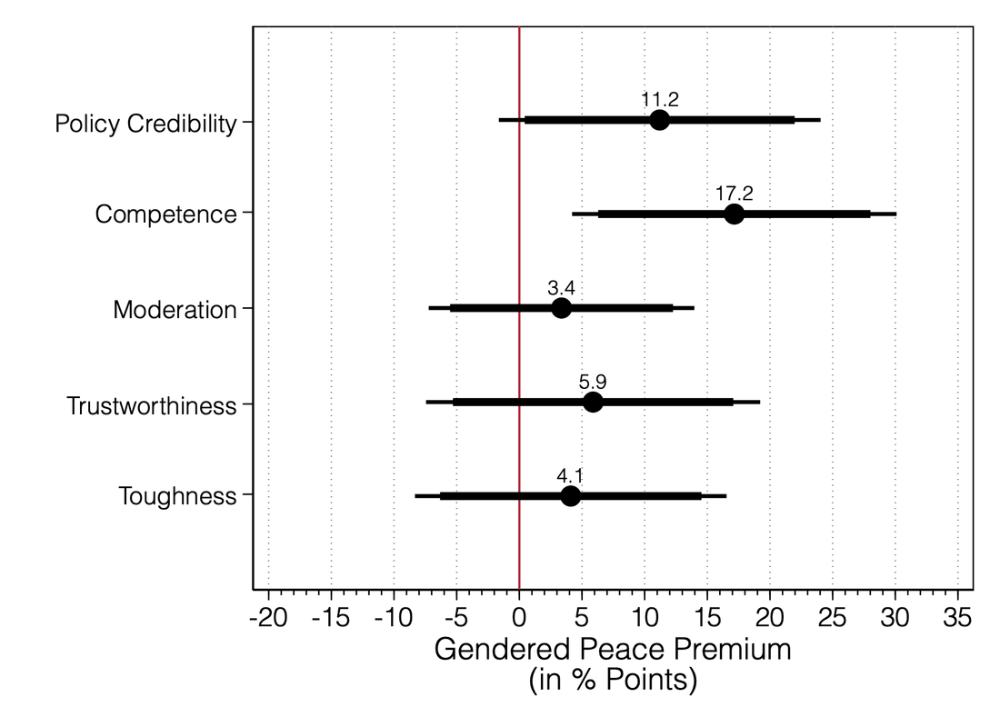

[Publisher](https://doi.org/10.1093/isq/sqad090) · [PDF](files/article-the-gendered-peace-premium.pdf) · [Appendix](files/appendix-the-gendered-peace-premium.pdf) · Pre-Analysis Plans ([1](files/pre-analysis-plan-the-gendered-peace-premium.pdf), [2](files/pre-analysis-plan-update-the-gendered-peace-premium.pdf)) · [Replication Data](https://doi.org/10.7910/DVN/VXYXTA)

[★ Winner, 2022 APSA Presidents & Executive Politics Founders Award]{.award}
::::
:::::

::::: {.pub}
:::: {.pubnum}
(9.)
::::
:::: {.pub-body}
**[The Strategic Logic of Large Militant Alliance Networks](https://doi.org/10.1093/jogss/ogac035)**

*Journal of Global Security Studies*, 2023, 8(1): 1–22 · with Philip B.K. Potter

Abstract

Ideological and operational credibility are essential to the success of transnational terrorist organizations. We demonstrate that militant groups can leverage large alliance networks to bolster their ideological and operational reputations. Organizations can draw on operational capabilities and successes to build international networks that bolster their ideological credibility; conversely, organizations with reputations for ideological authority can lend it to affiliates, who offer reach into active conflicts, bolstering claims to operational capacity. This logic of comparative advantage suggests that militant alliances can be a strategic response to underlying material or ideological deficits. We illustrate these dynamics through data-driven case studies of al-Qaeda and the Islamic State's cooperative networks.

[Publisher](https://doi.org/10.1093/jogss/ogac035) · [PDF](files/article-the-strategic-logic-of-large-militant-alliance-networks.pdf) · [Appendix](files/appendix-the-strategic-logic-of-large-militant-alliance-networks.pdf) · [Replication Data](https://doi.org/10.7910/DVN/MDVLYF)
::::
:::::

::::: {.pub}
:::: {.pubnum}
(8.)
::::
:::: {.pub-body}
**[Restitution or Retribution? Detainee Release and Insurgent Violence in Iraq](https://doi.org/10.1177/00220027221080118)**

*Journal of Conflict Resolution*, 2022, 66(7–8): 1356–1392

Abstract

Counterinsurgents frequently rely on mass arrests to impede rebel operations, but in so doing risk detaining innocent civilians. Wrongful detention can backfire, fueling insurgent violence by alienating detainees and their kin. Can counterinsurgents mitigate wrongful detention through targeted compensation? Using project-level data on US payments to individuals deemed innocent and released from Coalition custody in Iraq between 2004 and 2008, and leveraging plausibly exogenous variation in the allocation of detainee-release payments, I document a robust, negative association between counterinsurgent compensation for wrongful detention and insurgent violence. The violence-reducing effects were greatest in Sunni and mixed sectarian areas; for the types of attacks most prone to civilian informing; and when detainee release was complemented by other population-centric reforms. Post-harm mitigation helps shift civilian perceptions, inducing civilians to share more information with counterinsurgent forces.

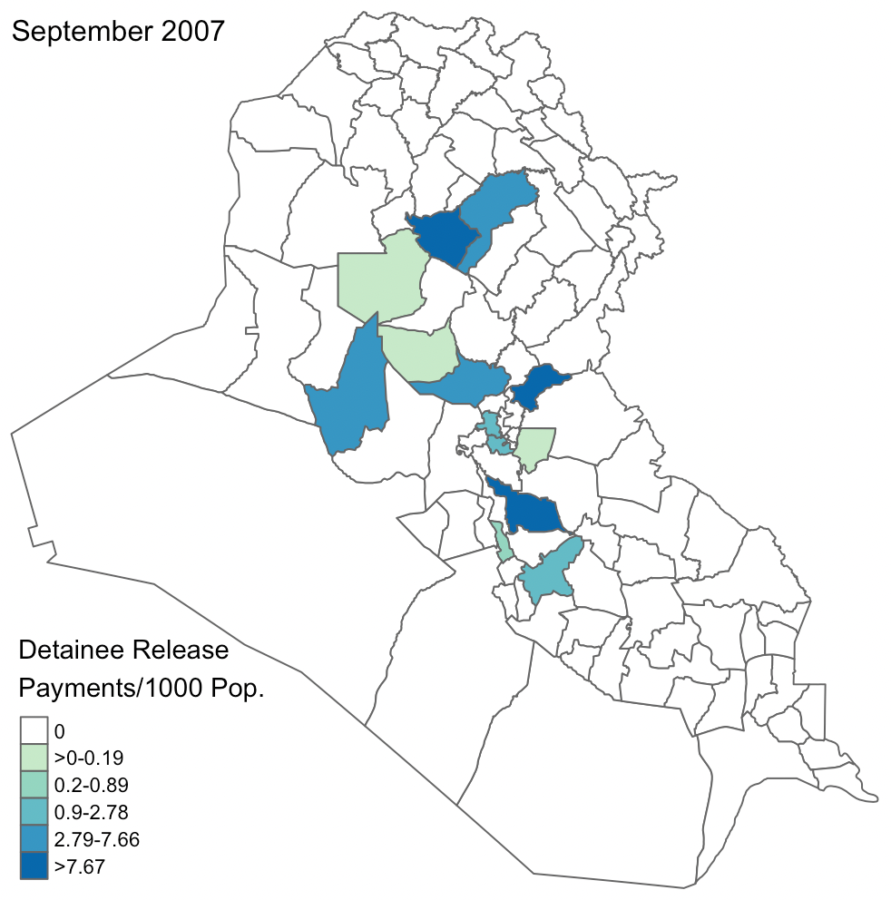
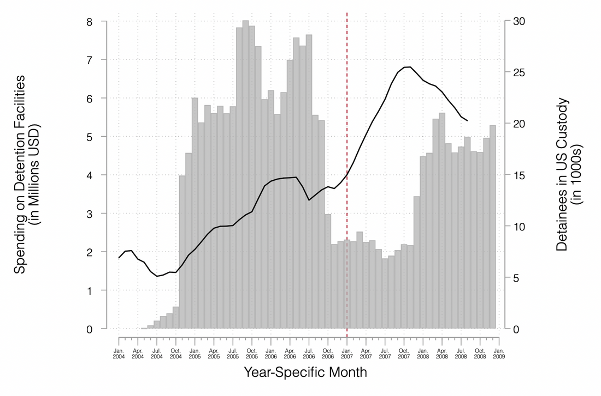

[Publisher](https://doi.org/10.1177/00220027221080118) · [PDF](files/article-restitution-or-retribution.pdf) · [Appendix](files/appendix-restitution-or-retribution.pdf) · [Replication Data](https://doi.org/10.7910/DVN/YW15MF)
::::
:::::

::::: {.pub}
:::: {.pubnum}
(7.)
::::
:::: {.pub-body}
**[Forced Displacement and Asylum Policy in the Developing World](https://doi.org/10.1017/S0020818321000369)**

*International Organization*, 2022, 76(2): 337–378 · with Guy Grossman and Jeremy M. Weinstein

Abstract

Little theoretical or empirical work examines migration policy in the developing world. We develop and test a theory distinguishing the drivers of policy reform from the factors influencing its direction. We introduce an original dataset of *de jure* asylum and refugee policies covering more than ninety developing countries excluded from existing migration-policy indices. Unlike in the global North, forced-displacement policies in the global South have become more liberal over time. Intense, proximate civil wars are the primary impetus for asylum-policy change; liberalizing changes are made by regimes led by political elites whose ethnic kin confront discrimination or violence in neighboring countries. We find no generalizable evidence that developing countries liberalize asylum policy in exchange for economic assistance from Western actors. Distinct frameworks are needed to understand migration policymaking in developing versus developed countries.

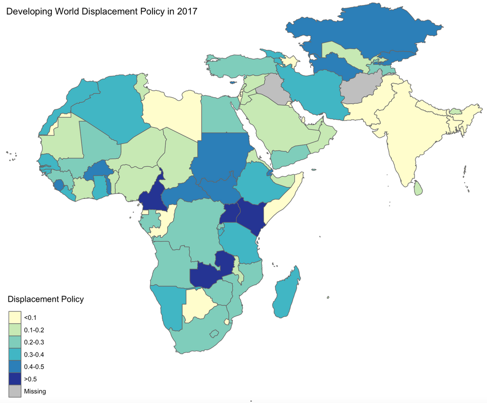
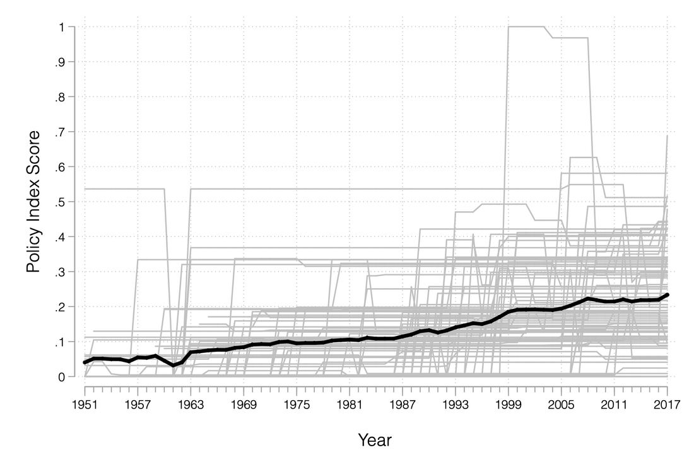

[Publisher](https://doi.org/10.1017/S0020818321000369) · [PDF](files/article-forced-displacement-and-asylum-policy-in-the-developing-world.pdf) · [Appendix](files/appendix-forced-displacement-and-asylum-policy-in-the-developing-world.pdf) · [Replication Data](https://doi.org/10.7910/DVN/OB6FHX) · [Talk](https://www.youtube.com/watch?v=fLyyo88BJlE)
::::
:::::

::::: {.pub}
:::: {.pubnum}
(6.)
::::
:::: {.pub-body}
**[The Two Faces of Opposition to Chemical Weapons: Sincere Versus Insincere Norm-Holders](https://doi.org/10.1177/00220027211057057)**

*Journal of Conflict Resolution*, 2022, 66(4–5): 677–703 · with Jonathan A. Chu and Joshua A. Schwartz

Abstract

Prominent research holds that the use of weapons of mass destruction is taboo. But how strong are these norms? We argue that some citizens support taboo policies in private but are unwilling to express counter-normative opinions openly due to fear of social sanction. These insincere norm-holders are difficult to identify because they are observationally equivalent to sincere norm-holders in direct-question surveys. Using a list design, we find across three list experiments that between 10 and 17% of Americans falsify their preferences over chemical-weapons use when asked directly. Our conceptualization of insincere norm-holders and our methodological application have broad implications for how scholars measure norms in international politics.

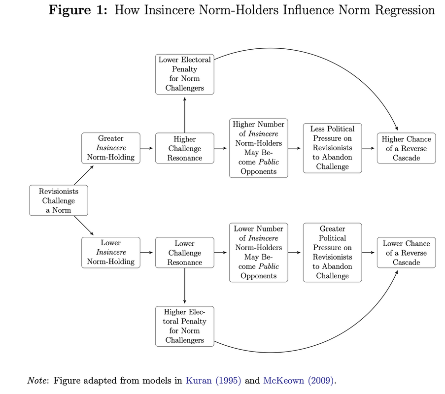
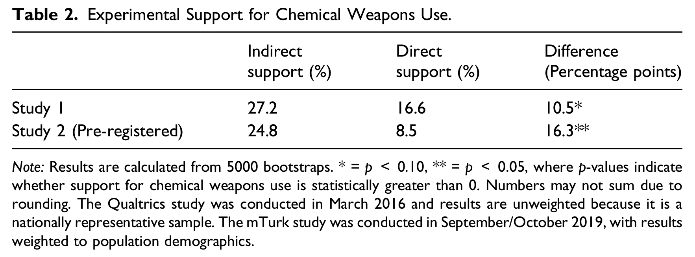

[Publisher](https://doi.org/10.1177/00220027211057057) · [PDF](files/article-the-two-faces-of-opposition-to-chemical-weapons.pdf) · [Appendix](files/appendix-the-two-faces-of-opposition-to-chemical-weapons.pdf) · [Pre-Analysis Plan](https://osf.io/2znfs) · [Replication Data](https://doi.org/10.7910/DVN/HQFXFL)
::::
:::::

::::: {.pub}
:::: {.pubnum}
(5.)
::::
:::: {.pub-body}
**[Leadership Targeting and Militant Alliance Breakdown](https://doi.org/10.1086/715604)**

*The Journal of Politics*, 2022, 84(2): 923–943 · with Michael C. Horowitz and Philip B.K. Potter

Abstract

Cooperation between militant groups is common and contributes to both capabilities and lethality, but little is known about how militant alliances are maintained and how they break apart. We argue that leaders are critical to sustaining alliances, so organizational disruption through leadership targeting can lead to alliance breakdown. Pairing original data on militant alliances with data on leadership targeting, we find that decapitating an organization's leader — and particularly its founder — increases the probability that its alliances terminate. Leadership decapitation spurs alliance termination by incapacitating targeted groups, stoking fear among allies, and inducing preference divergence over strategy.

[Publisher](https://doi.org/10.1086/715604) · [PDF](files/article-leadership-targeting-and-militant-alliance-breakdown.pdf) · [Appendix](files/appendix-leadership-targeting-and-militant-alliance-breakdown.pdf) · [Replication Data](https://doi.org/10.7910/DVN/DAQ9PK)
::::
:::::

::::: {.pub}
:::: {.pubnum}
(4.)
::::
:::: {.pub-body}
**[Honor Among Thieves: Understanding Rhetorical and Material Cooperation Among Violent Non-State Actors](https://doi.org/10.1017/S0020818321000114)**

*International Organization*, 2022, 76(1): 164–203 · with Erica Chenoweth, Michael C. Horowitz, Evan Perkoski, and Philip B.K. Potter

Abstract

Cooperation among militant organizations contributes to capability but also presents security risks, particularly when organizations face substantial state repression. For cooperation to persist when it is most valuable, militant groups must be able to commit even when incentives to defect are high. We posit that shared ideology plays this role by providing community monitoring, authority structures, trust, and transnational networks. Using new, expansive time-series data on relationships between militant organizations from 1950 to 2016, we show that when groups share an ideology — and especially a religion — they are more likely to sustain material cooperation in the face of state repression.

[Publisher](https://doi.org/10.1017/S0020818321000114) · [PDF](files/article-honor-among-thieves.pdf) · [Appendix](files/appendix-honor-among-thieves.pdf) · [Replication Data](https://doi.org/10.7910/DVN/PHUSUM)
::::
:::::

::::: {.pub}
:::: {.pubnum}
(3.)
::::
:::: {.pub-body}
**[Liberal Displacement Policies Attract Forced Migrants in the Global South](https://doi.org/10.1017/S0003055421000848)**

*American Political Science Review*, 2022, 116(1): 351–358 · with Guy Grossman and Jeremy M. Weinstein

Abstract

Most forced migrants are displaced within the Global South. We study whether and how *de jure* policies on forced displacement affect where forced migrants flee in the developing world. Existing analyses expect *de jure* policies to have little effect, given presumptions that enforcement is poor and policy knowledge is low. Using original data on *de jure* displacement policies for 92 developing countries and interviews with 126 refugees and policymakers, we document a robust association between liberal *de jure* policies and forced-migrant flows. Gravitation toward liberal environments is conditional on factors that facilitate the diffusion of policy knowledge, such as transnational ethnic kin. Policies for free movement, services, and livelihoods are especially attractive.

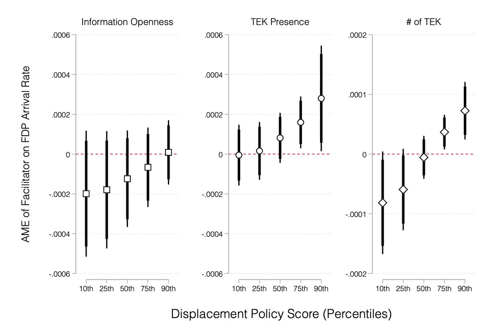
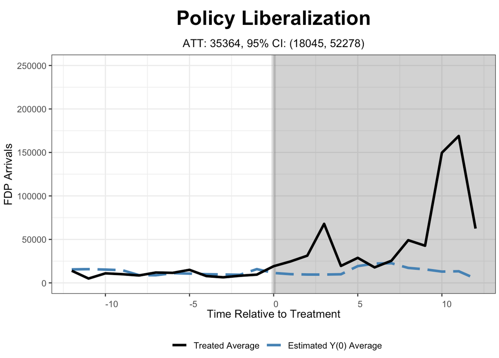

[Publisher](https://doi.org/10.1017/S0003055421000848) · [PDF](files/article-liberal-displacement-policies-attract-forced-migrants-in-the-global-south.pdf) · [Appendix](files/appendix-liberal-displacement-policies-attract-forced-migrants-in-the-global-south.pdf) · [Replication Data](https://doi.org/10.7910/DVN/AYBXMJ)
::::
:::::

::::: {.pub}
:::: {.pubnum}
(2.)
::::
:::: {.pub-body}
**[Changing Tides: Public Attitudes on Climate Migration](https://doi.org/10.1086/715163)**

*The Journal of Politics*, 2022, 84(1): 560–567 · with Sabrina B. Arias

Abstract

Little existing work studies public perceptions of climate-induced migration. We argue that climate migrants occupy an intermediate position in the public view, garnering greater support than traditional economic migrants but less support than refugees. Evidence from a conjoint experiment embedded in nationally representative surveys of 2,160 respondents in the U.S. and Germany supports this claim, and holds for internal and international migrants — suggesting the importance of humanitarian considerations and empathy in shaping migration attitudes. A follow-up factorial experiment finds no evidence that priming climate migration increases support for climate-change mitigation, suggesting that climate migration is unlikely to spur greater support for mitigating climate change.

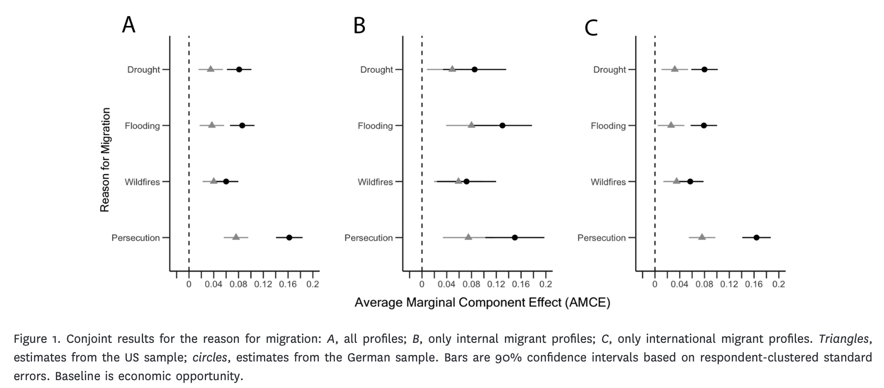

[Publisher](https://doi.org/10.1086/715163) · [PDF](files/article-changing-tides.pdf) · [Appendix](files/appendix-changing-tides.pdf) · [Pre-Analysis Plan](https://osf.io/g6pvd) · [Replication Data](https://doi.org/10.7910/DVN/FDML2N)
::::
:::::

::::: {.pub}
:::: {.pubnum}
(1.)
::::
:::: {.pub-body}
**[Do Women Make More Credible Threats? Gender Stereotypes, Audience Costs, and Crisis Bargaining](https://doi.org/10.1017/S0020818320000223)**

*International Organization*, 2020, 74(4): 872–895 · with Joshua A. Schwartz

Abstract

As more women attain executive office, it is important to understand how gender dynamics affect international politics. We present the first evidence that gender stereotypes affect leaders' abilities to generate audience costs. Using survey experiments, we find a common gender stereotype: that men are better able to handle military crises than women. Female leaders, and male leaders facing female leaders, pay greater inconsistency costs for backing down from threats than male leaders do against fellow men. Female leaders are thus better able to tie hands — an efficient mechanism for establishing credibility in crises — but will also have a harder time backing down from threats.

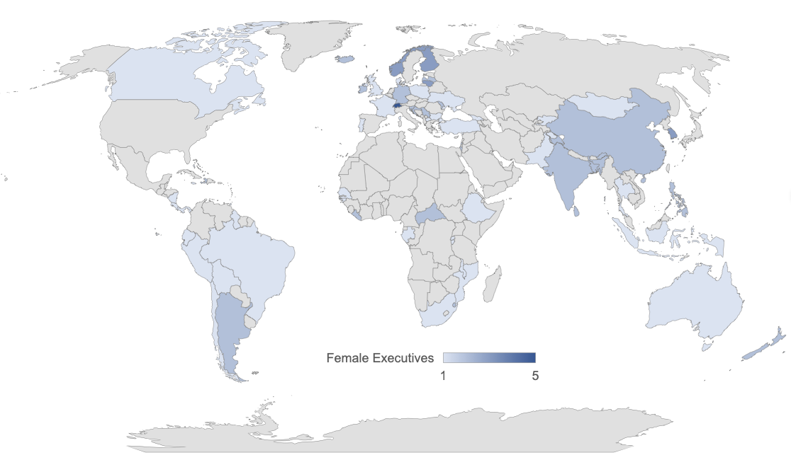
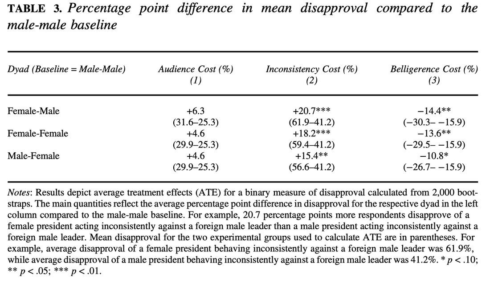

[Publisher](https://doi.org/10.1017/S0020818320000223) · [PDF](files/article-do-women-make-more-credible-threats.pdf) · [Appendix](files/appendix-do-women-make-more-credible-threats.pdf) · [Pre-Analysis Plan](https://osf.io/eyn5k) · [Replication Data](https://doi.org/10.7910/DVN/LRP3SZ)

[★ Winner, 2019 TESS Young Investigator Competition]{.award}
::::
:::::

## Working Papers & Under Review

::::: {.pub}
:::: {.pub-body}
**[Diversionary Escalation: Theory and Evidence from Eastern Ukraine](https://papers.ssrn.com/sol3/papers.cfm?abstract_id=6174480)**

with Natalie Ayers, Joseph J. Ruggiero, Konstantin Sonin, and Austin L. Wright

*Revise & resubmit, American Political Science Review*
::::
:::::

::::: {.pub}
:::: {.pub-body}
**[From Allies to Neighbors: The Impact of Military Service on Public Support for Refugee Resettlement](https://papers.ssrn.com/sol3/papers.cfm?abstract_id=5186927)**

with Rikio Inouye

*Revise & resubmit, American Journal of Political Science*

[★ Winner, 2024 CivicPulse Young Investigator Competition]{.award}
::::
:::::

::::: {.pub}
:::: {.pub-body}
**[Territorial Control in Civil War](https://papers.ssrn.com/sol3/papers.cfm?abstract_id=4912415)**

with María Ballesteros, Igor Kolesnikov, and Austin L. Wright

*Revise & resubmit, World Politics*
::::
:::::

::::: {.pub}
:::: {.pub-body}
**[Maximum Pressure: How Refugee Repatriation Affects Conflict](https://papers.ssrn.com/sol3/papers.cfm?abstract_id=5081898)**

with Benjamin Krick and Austin L. Wright
::::
:::::

::::: {.pub}
:::: {.pub-body}
**[Offshoring Migration Policy: Migrant Responses to Restrictive Policies in Transit Countries](https://papers.ssrn.com/sol3/papers.cfm?abstract_id=5236161)**

with Omer Solodoch
::::
:::::

::::: {.pub}
:::: {.pub-body}
**[Building Walls, Building Bridges: Border Fortification and Insurgent Influence](https://papers.ssrn.com/sol3/papers.cfm?abstract_id=5396305)**

with Luwei Ying
::::
:::::

::::: {.pub}
:::: {.pub-body}
**[Combat Experience and Foreign Policy Attitudes: Evidence from World War II](https://papers.ssrn.com/sol3/papers.cfm?abstract_id=3895940)**

with Michael C. Horowitz
::::
:::::

::::: {.pub}
:::: {.pub-body}
**Beyond Meating Climate Goals: Masculinity and Climate Policy Backlash**

with Joshua A. Schwartz and Sabrina B. Arias

[★ Winner, 2025 APSA Paul Sabatier Award for Best Paper on Science, Technology, and Environmental Politics]{.award}
::::
:::::

::::: {.pub}
:::: {.pub-body}
**Do Refugees Fuel Conflict, or Just Make It Visible?**

with Zhejun Qiu and Burcu Savun
::::
:::::

## Other Publications

- **Border Walls and Security** (with Jeongmin Park). Forthcoming in Elisabeth Vallet (ed.), *Handbook on Border Walls*. Edward Elgar.
- **Discussion of "Public Policies for Peace."** 2025. *Economic Policy* 40(124): 927–929.
- Review of *Governing the Displaced: Race and Ambivalence in Global Capitalism* by Ali Bhagat. 2024. *H-Diplo*.
- Review of *Discrimination and Delegation: Explaining State Responses to Refugees* by Lamis Elmy Abdelaaty. 2023. *International Migration Review* 57(1): 475–477.

## Selected Works in Progress

- The Politics of Constraining Humanitarian Access in Conflict
- Counterinsurgent Propaganda: Winning Hearts and Minds on the Airwaves (with Austin L. Wright)
- Sequencing Conquest: How the Taliban Won Afghanistan (with Austin L. Wright)
- Leadership Turnover and Insurgent Fratricide: Evidence from Afghanistan
- Information Manipulation and Tactical Escalation on the Battlefield: Evidence from the Donbas (with Joseph J. Ruggiero)
- Measuring and Fighting Online Survey Fraud (with Alexander Gazmararian)
- Folklore and Climate Attitudes (with Shikhar Singh)
- The Politics of Climate Adaptation: Bluelining, Insurance Reform, and Voting (with Sabrina B. Arias and Alexander Gazmararian)
- Racial Strife in the U.S. Military During World War II (with Jeongmin Park)
