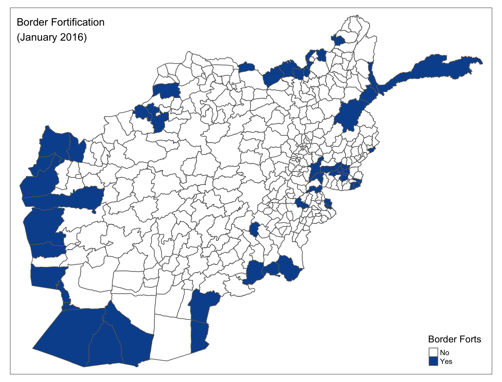
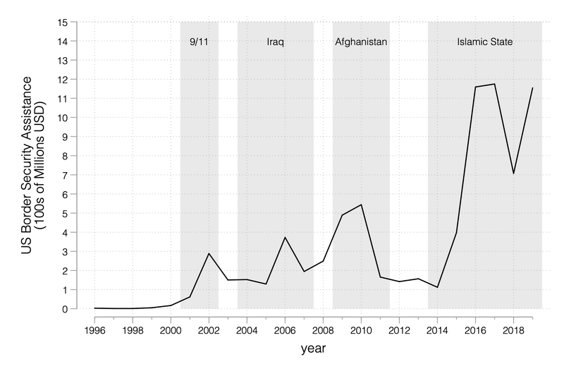
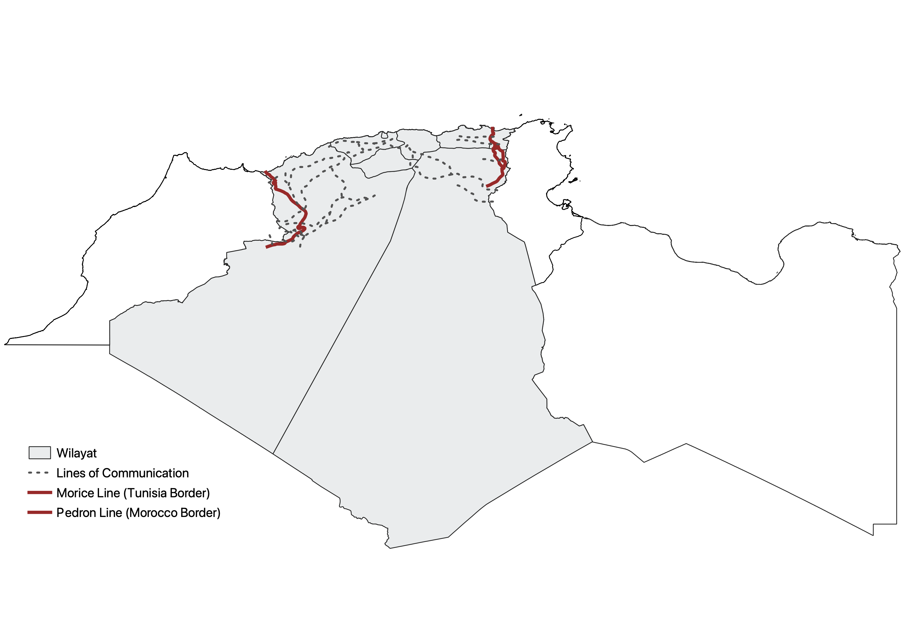

How does border fortification impact the micro-dynamics of civil conflict? My research in this area pioneers a border-centric approach to understanding the transnational dimensions of civil war. I outline several trade-offs confronting counterinsurgents interested in pursuing border fortification to stem cross-border militancy. This project highlights how resource constraints impact rebel tactics, how rebels and civilians adapt to the expansion of state authority in borderland communities, and how U.S. border-security assistance has inadvertently fueled border hardening.

From Syria and Iraq to Afghanistan, Ukraine, India, and Somalia, recent episodes of civil conflict highlight three prominent phenomena: (1) the U.S. is increasingly funding border-control initiatives abroad, with an eye toward countering transnational, non-state threats; (2) borders are hardening in response, with counterinsurgents' efforts to secure borders against transnational militancy partially driving this trend; and (3) because rebels often exploit transnational safe havens, border-control efforts that interdict transnational militant operations have important implications for the micro-dynamics of civil conflict. In this book project, I provide empirical support for these claims using a multi-method design.

Although an emerging literature studies border control, and large literatures examine the causes and consequences of state sponsorship and the externalization of civil conflict, insufficient attention has been paid to the interrelation between border control and transnational militancy. Each of these literatures is also plagued by a number of theoretical and empirical shortcomings. For instance, the border-control literature emphasizes political-economy explanations and traces border-control strategies to domestic statebuilding trajectories, neglecting the influence of enhanced insurgent capabilities to exploit transnational havens, as well as external influences on border-control strategies, such as foreign aid. The state-sponsorship literature takes an overly static view, assuming that foreign support — and especially foreign territorial support — for insurgents is relatively stable over time. Existing work in this vein largely ignores the fact that the transnational nature of rebellion is often a subject of contestation in and of itself. Counterinsurgents actively seek to impede and deny insurgent safe havens. Finally, scholarship on the externalization of civil conflict focuses on the interstate and bargaining implications of cross-border insurgent activities, but devotes little attention to how insurgent access to transnational safe haven affects political micro-dynamics within and after conflicts. Linking these literatures, this project dispels a number of common assumptions about border control and transnational militancy, and develops a more complete framework for understanding how and why border control affects transnational militancy — and vice versa.

To summarize my core findings in brief, I show that: (1) counterinsurgent border control is a common and understudied strategy for governments facing transnational rebels; (2) that border hardening since 2001 is linked with the expansion of U.S. aid and training programs for border security, which comprise a key facet of U.S. strategy in the Global War on Terrorism; (3) that border-control measures have important effects on insurgent tactics, cohesion, and political strategy; and (4) that insurgent adaptations to border control generate critical trade-offs for counterinsurgents interested in fortifying their borders against transnational threats. To elaborate these arguments, I leverage new, cross-national data on counterinsurgent border-control measures and U.S. aid for border security, fine-grained microdata on border-security initiatives and violence in Iraq and Afghanistan, restricted-access public-opinion data from representative surveys fielded in Afghanistan, and qualitative archival evidence. Recently, I published two related articles in the *American Journal of Political Science* on border fortification in [Iraq](https://doi.org/10.1111/ajps.12794) and [Afghanistan](https://doi.org/10.1111/ajps.12923).

```{=html}
<div id="bookCarousel" class="carousel slide fig-carousel" data-bs-ride="carousel" data-bs-interval="7000">
  <div class="carousel-inner">
    <div class="carousel-item active">
      
      <div class="carousel-caption-below">Number of border forts across Iraqi provinces, November 2006.</div>
    </div>
    <div class="carousel-item">
      
      <div class="carousel-caption-below">Border fortification across Afghan districts, January 2016.</div>
    </div>
    <div class="carousel-item">
      
      <div class="carousel-caption-below">U.S. border-security assistance over time (hundreds of millions USD), with the 9/11, Iraq, Afghanistan, and Islamic State periods shaded.</div>
    </div>
    <div class="carousel-item">
      
      <div class="carousel-caption-below">FLN lines of communication and French border fortifications — the Morice Line (Tunisia border) and Pedron Line (Morocco border) — during the Algerian War of Independence.</div>
    </div>
  </div>
  <button class="carousel-control-prev" type="button" data-bs-target="#bookCarousel" data-bs-slide="prev">
    <span class="carousel-control-prev-icon" aria-hidden="true"></span>
    <span class="visually-hidden">Previous</span>
  </button>
  <button class="carousel-control-next" type="button" data-bs-target="#bookCarousel" data-bs-slide="next">
    <span class="carousel-control-next-icon" aria-hidden="true"></span>
    <span class="visually-hidden">Next</span>
  </button>
  <div class="carousel-indicators">
    <button type="button" data-bs-target="#bookCarousel" data-bs-slide-to="0" class="active" aria-current="true" aria-label="Slide 1"></button>
    <button type="button" data-bs-target="#bookCarousel" data-bs-slide-to="1" aria-label="Slide 2"></button>
    <button type="button" data-bs-target="#bookCarousel" data-bs-slide-to="2" aria-label="Slide 3"></button>
    <button type="button" data-bs-target="#bookCarousel" data-bs-slide-to="3" aria-label="Slide 4"></button>
  </div>
</div>
```
